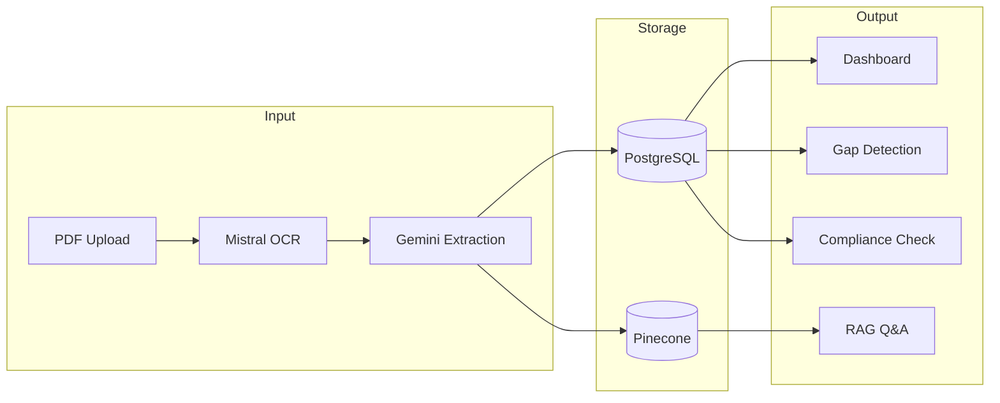

# Open Insurance Platform - Overview

## What We're Building

Open Insurance is an AI-powered insurance management platform for commercial real estate (CRE) owners. It transforms scattered, opaque insurance documents into structured, queryable intelligence.

**The one-liner:** "Know exactly what you're covered for, what you're paying, and what you're missing — without reading a single policy."

---

## The Problem

Commercial real estate insurance is broken:

### For Property Owners

| Pain Point | Reality |
|------------|---------|
| **No visibility** | Policies buried in emails, ShareFiles, broker portals. Owners don't know what they're covered for. |
| **Incomprehensible documents** | A 50-page policy with legal jargon. No one reads them until there's a claim. |
| **Renewal chaos** | Every year is a scramble. No time to compare, no leverage to negotiate. |
| **Coverage gaps** | Discovered only when filing a claim. "Sorry, that's excluded." |
| **Lender pressure** | Banks demand proof of coverage. Owners scramble to produce certificates. |
| **Overpaying** | No benchmarks. Is $1,200/unit good? Bad? No one knows. |

### Why This Exists

The insurance industry profits from opacity. Brokers, wholesalers, and MGAs add layers of fees. Documents are intentionally complex. There's no incentive to make this easy for owners.

**The market is $300B+ in commercial property insurance premiums annually.** And it runs on PDFs, emails, and phone calls.

---

## The Solution

Open Insurance creates a **single source of truth** for CRE insurance:

```
┌─────────────────────────────────────────────────────────────────────────────┐
│                                                                             │
│   BEFORE                              AFTER                                 │
│   ──────                              ─────                                 │
│                                                                             │
│   📁 Scattered PDFs                   📊 Unified Dashboard                  │
│   📧 Buried in emails                 🔍 Searchable & queryable             │
│   ❓ "Am I covered?"                  ✅ "Yes, up to $1M, see policy p.23"  │
│   😰 Renewal panic                    📅 120-day automated runway           │
│   🏦 Lender scramble                  📋 One-click compliance check         │
│                                                                             │
└─────────────────────────────────────────────────────────────────────────────┘
```

---

## How It Works



### The Pipeline

1. **Upload** — Owner uploads insurance documents (policies, COIs, invoices, etc.)
2. **OCR** — Mistral OCR 3 extracts text and tables from any PDF format
3. **Extract** — Gemini 2.5 Flash converts unstructured text into structured data via Pydantic schemas
4. **Store** — Structured data goes to PostgreSQL; document chunks go to Pinecone for semantic search
5. **Serve** — Dashboard shows portfolio view; RAG answers natural language questions

---

## Core Concepts

Before diving deeper, here's a glossary of insurance terms used throughout this documentation:

### The Players

| Term | Definition | Example |
|------|------------|---------|
| **Property Owner** | The customer. Owns commercial real estate, needs insurance. | John owns 5 apartment buildings |
| **Insured Entity** | The LLC/LP that legally owns the property. Created for liability protection. | "Buffalo Run Apartments LP" |
| **Carrier** | The insurance company that provides coverage and pays claims. | Seneca Insurance, Travelers |
| **Lender** | The bank that holds the mortgage. Has insurance requirements. | Wells Fargo, Fannie Mae |
| **Broker** | Middleman who helps owners buy insurance. | Marsh, local agencies |

### The Documents

| Document | Purpose | Who Creates It |
|----------|---------|----------------|
| **Policy** | Legal contract defining coverage. The source of truth. | Carrier |
| **COI** (Certificate of Insurance) | Proof that coverage exists. Sent to third parties. | Carrier/Broker |
| **EOP** (Evidence of Property) | Proof for lenders specifically. Includes loan info. | Carrier/Broker |
| **Endorsement** | Amendment that modifies the policy. | Carrier |
| **SOV** (Statement of Values) | List of properties with their insured values. | Owner/Broker |
| **Loss Run** | History of past claims. | Carrier |
| **Invoice** | Bill for premium payment. | Carrier/Broker |

### The Coverage Types

| Type | What It Protects Against |
|------|--------------------------|
| **Property** | Physical damage to buildings (fire, storm, water) |
| **General Liability (GL)** | Lawsuits from injuries on the property |
| **Umbrella/Excess** | Additional liability coverage above GL limits |
| **Business Income (BI)** | Lost rental income if property is unusable |
| **Flood** | Flood damage (usually separate policy) |
| **Earthquake** | Earthquake damage (usually separate policy) |

### Key Numbers

| Term | Definition | Example |
|------|------------|---------|
| **Limit** | Maximum the insurance will pay | $1,000,000 per occurrence |
| **Deductible** | What owner pays before insurance kicks in | $10,000 flat, or 2% of building value |
| **Premium** | Annual cost of the insurance | $45,000/year |
| **TIV** (Total Insured Value) | Total value of everything covered | $35,000,000 |

---

## MVP Features

The minimum viable product includes six core features:

### 1. Document Upload & Extraction

Upload any insurance document. System extracts structured data automatically.

**Input:** PDF (policy, COI, invoice, etc.)
**Output:** Structured records in database (policies, coverages, limits, dates)

### 2. Property & Policy Dashboard

Single view of all properties and their insurance status.

- List of properties with key metrics
- Drill-down to policies, coverages, documents
- Expiration timeline
- Quick stats (total premium, total insured value)

### 3. RAG-Powered Q&A

Ask questions in plain English, get answers with citations.

**Example queries:**
- "Is flood covered at Buffalo Run?"
- "What's my wind deductible at Shoaff Park?"
- "Which properties don't have umbrella coverage?"
- "Am I covered if a tenant's dog bites a visitor?"

**Response includes:**
- Direct answer
- Source document and page number
- Confidence level

### 4. Coverage Gap Detection

Automatic identification of potential problems:

- Underinsurance (building value exceeds coverage)
- Missing coverage types (no flood in flood zone)
- High deductibles (can owner absorb a $200K wind deductible?)
- Expiring policies (no coverage in 30 days)

### 5. Document Completeness Tracker

Shows what's missing for each property:

```
Buffalo Run: ✅ Complete
  ✓ Property Policy
  ✓ GL Policy
  ✓ Umbrella Policy
  ✓ COI
  ✓ Loss Runs

Shoaff Park: ⚠️ Incomplete (60%)
  ✓ Property Certificate
  ✓ Liability Certificate
  ✗ Full Policy Documents (missing)
  ✗ SOV (missing)
  ✗ Loss Runs (missing)
```

### 6. Lender Compliance Checking

Verify that coverage meets lender requirements:

**Input:** Lender requirements (can be extracted from loan docs or manually entered)
**Output:** Compliance status with specific gaps

```
Wells Fargo Loan #12345 Requirements:
  ✓ Property coverage ≥ $10M — You have $12M
  ✓ GL coverage ≥ $1M — You have $1M
  ✗ Wind deductible ≤ 2% — You have 5% (NON-COMPLIANT)
  ✓ Lender listed as mortgagee — Confirmed
```

---

## Post-MVP Features

Features planned for future releases:

### Insurance Score (v1.1)
A 0-100 score per property indicating overall insurance health:
- Coverage adequacy
- Compliance status
- Documentation completeness
- Pricing efficiency

### Policy Comparison Engine (v1.1)
Upload two policies (e.g., current vs renewal), get a plain-English diff:
- What changed
- What was removed
- Premium impact
- Risk implications

### Renewal Intelligence (v1.2)
- 120-day renewal timeline with milestones
- Year-over-year comparison
- Market trend context
- Automated document preparation

### Premium Benchmarking (v1.2)
- Compare cost per unit to similar properties
- Identify if overpaying
- Negotiation leverage

### Portfolio Risk Heatmap (v2.0)
- Geographic concentration risk
- Carrier concentration risk
- Expiration clustering
- Visual risk dashboard

### Program Simulator (v2.0)
- "What if I increase my deductible to 5%?"
- "What if I drop umbrella coverage?"
- Model premium and risk trade-offs

---

## Target Users

### Primary: Property Owners

- Own 5-500+ multifamily units
- Spend $50K-$5M+ annually on insurance
- Frustrated by lack of visibility
- Want control over their renewals

**Jobs to be done:**
- Understand what I'm covered for
- Know if I have gaps
- Prepare for renewals
- Satisfy lender requirements

### Secondary: Property Managers

- Manage insurance across multiple owner portfolios
- Need compliance tracking
- Want centralized document storage

### Future: Lenders

- Require proof of coverage for loan compliance
- Need automated monitoring of borrower coverage
- Want early warning of coverage lapses

---

## Success Metrics

### MVP Success

| Metric | Target |
|--------|--------|
| Document extraction accuracy | >95% on key fields |
| RAG answer relevance | >90% user satisfaction |
| Time to understand coverage | <60 seconds (vs hours today) |
| Properties fully onboarded | 50+ in pilot |

### Product-Market Fit Indicators

- Users upload documents without prompting
- Users return weekly to check status
- Users ask for features (not just report bugs)
- Word-of-mouth referrals

---

## Why Now?

Several converging factors make this the right time:

1. **Premiums have exploded** — Multifamily insurance up 200-300% since 2021. Owners are actively looking for solutions.

2. **AI can finally read policies** — LLMs + OCR make document understanding viable at scale.

3. **Owners are demanding transparency** — The industry is openly calling for change.

4. **No good solutions exist** — Current tools are either document storage (dumb) or broker CRMs (not for owners).

5. **Data creates moats** — Every policy uploaded improves extraction, benchmarks, and intelligence.

---

## Document Map

This overview is the first of 10 documentation files:

| Doc | Purpose |
|-----|---------|
| **00-overview.md** | This document. The big picture. |
| [01-architecture.md](./01-architecture.md) | System design and tech stack |
| [02-database-schema.md](./02-database-schema.md) | Full database schema with explanations |
| [03-data-ingestion.md](./03-data-ingestion.md) | How documents get into the system |
| [04-extraction-pipeline.md](./04-extraction-pipeline.md) | OCR → LLM → Structured data |
| [05-rag-system.md](./05-rag-system.md) | Embeddings, Pinecone, retrieval |
| [06-api-design.md](./06-api-design.md) | API endpoints and contracts |
| [07-mvp-features.md](./07-mvp-features.md) | Detailed feature specifications |
| [08-development-roadmap.md](./08-development-roadmap.md) | Implementation timeline |
| [09-decision-log.md](./09-decision-log.md) | Key decisions and rationale |

---

## Next Steps

Proceed to [01-architecture.md](./01-architecture.md) to understand how the system is designed.
