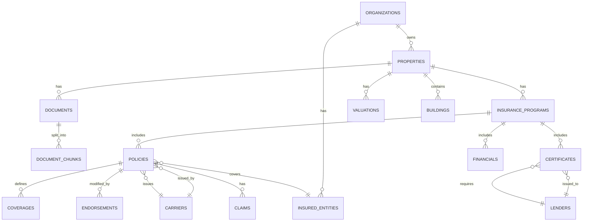

# Database Schema

## Overview

This document defines the complete database schema for Open Insurance. The schema is designed to:

1. **Capture the full insurance domain** — Properties, policies, coverages, certificates, claims
2. **Track data provenance** — Every fact traces back to its source document
3. **Support progressive enrichment** — Handle incomplete data gracefully
4. **Enable the features we need** — Gap detection, compliance, RAG

---

## Entity Relationship Diagram



---

## Schema Design Principles

### 1. Nullable by Default

Most fields are nullable because:
- Documents may be missing
- Extraction may fail for some fields
- Data is progressively enriched

We track "data completeness" rather than requiring complete data.

### 2. Provenance Tracking

Key tables include:
- `source_document_id` — Which document this came from
- `source_page` — Which page in the document
- `extraction_confidence` — How confident are we in this value

### 3. Soft Deletes

Records are never hard-deleted. Instead:
- `deleted_at` timestamp marks deletion
- Queries filter for `deleted_at IS NULL`

### 4. Audit Fields

Every table includes:
- `created_at` — When the record was created
- `updated_at` — When it was last modified

---

## Core Tables

### organizations

Multi-tenancy support. Each organization is a separate customer.

```sql
CREATE TABLE organizations (
    id UUID PRIMARY KEY DEFAULT gen_random_uuid(),

    -- Identity
    name TEXT NOT NULL,
    slug TEXT UNIQUE NOT NULL,           -- URL-friendly identifier

    -- Contact
    primary_email TEXT,
    phone TEXT,

    -- Settings
    settings JSONB DEFAULT '{}',         -- Feature flags, preferences

    -- Subscription (future)
    plan TEXT DEFAULT 'free',
    trial_ends_at TIMESTAMP WITH TIME ZONE,

    -- Audit
    created_at TIMESTAMP WITH TIME ZONE DEFAULT NOW(),
    updated_at TIMESTAMP WITH TIME ZONE DEFAULT NOW(),
    deleted_at TIMESTAMP WITH TIME ZONE
);

CREATE INDEX idx_organizations_slug ON organizations(slug) WHERE deleted_at IS NULL;
```

**Notes:**
- For MVP, we'll have a single organization
- Multi-tenancy is built in from the start for future scaling

---

### properties

Real estate properties that need insurance.

```sql
CREATE TABLE properties (
    id UUID PRIMARY KEY DEFAULT gen_random_uuid(),
    organization_id UUID NOT NULL REFERENCES organizations(id),

    -- Identity
    name TEXT NOT NULL,                  -- "Buffalo Run", "Shoaff Park"
    external_id TEXT,                    -- Customer's internal ID

    -- Address
    address TEXT,
    address_line_2 TEXT,
    city TEXT,
    state TEXT,
    zip TEXT,
    county TEXT,                         -- Matters for some coverage
    country TEXT DEFAULT 'US',

    -- Property Characteristics
    property_type TEXT,                  -- "multifamily", "office", "retail", "industrial"
    units INTEGER,                       -- For multifamily
    sq_ft INTEGER,
    year_built INTEGER,
    stories INTEGER,

    -- Construction
    construction_type TEXT,              -- "frame", "masonry", "fire-resistive", "non-combustible"
    roof_type TEXT,                      -- "flat", "pitched", "metal"
    roof_year INTEGER,                   -- Year roof was replaced

    -- Protection
    has_sprinklers BOOLEAN,
    sprinkler_type TEXT,                 -- "wet", "dry", "partial"
    protection_class TEXT,               -- Fire department rating "1" to "10"
    alarm_type TEXT,                     -- "central", "local", "none"

    -- Risk Factors
    flood_zone TEXT,                     -- "X", "A", "AE", "V", "VE"
    earthquake_zone TEXT,
    wind_zone TEXT,                      -- "hurricane", "tornado_alley", "standard"
    crime_score INTEGER,                 -- 1-100

    -- Status
    status TEXT DEFAULT 'active',        -- "active", "sold", "inactive"

    -- Data Quality
    completeness_pct FLOAT DEFAULT 0,    -- How complete is our data? 0-100

    -- Audit
    created_at TIMESTAMP WITH TIME ZONE DEFAULT NOW(),
    updated_at TIMESTAMP WITH TIME ZONE DEFAULT NOW(),
    deleted_at TIMESTAMP WITH TIME ZONE,

    -- Constraints
    CONSTRAINT fk_property_org FOREIGN KEY (organization_id)
        REFERENCES organizations(id) ON DELETE CASCADE
);

CREATE INDEX idx_properties_org ON properties(organization_id) WHERE deleted_at IS NULL;
CREATE INDEX idx_properties_state ON properties(state) WHERE deleted_at IS NULL;
```

**Notes:**
- `completeness_pct` is computed based on how many expected documents we have
- Risk factors (flood_zone, etc.) can be auto-populated from external data sources later

---

### buildings

For properties with multiple buildings. Optional — simple properties may not use this.

```sql
CREATE TABLE buildings (
    id UUID PRIMARY KEY DEFAULT gen_random_uuid(),
    property_id UUID NOT NULL REFERENCES properties(id),

    -- Identity
    name TEXT,                           -- "Building A", "Main Building"
    building_number TEXT,

    -- Characteristics
    sq_ft INTEGER,
    stories INTEGER,
    year_built INTEGER,
    construction_type TEXT,
    occupancy_type TEXT,                 -- "residential", "commercial", "mixed"

    -- Values
    building_value NUMERIC,
    contents_value NUMERIC,

    -- Audit
    created_at TIMESTAMP WITH TIME ZONE DEFAULT NOW(),
    updated_at TIMESTAMP WITH TIME ZONE DEFAULT NOW(),
    deleted_at TIMESTAMP WITH TIME ZONE,

    CONSTRAINT fk_building_property FOREIGN KEY (property_id)
        REFERENCES properties(id) ON DELETE CASCADE
);

CREATE INDEX idx_buildings_property ON buildings(property_id) WHERE deleted_at IS NULL;
```

---

### documents

Source documents uploaded to the system.

```sql
CREATE TABLE documents (
    id UUID PRIMARY KEY DEFAULT gen_random_uuid(),
    property_id UUID REFERENCES properties(id),  -- Can be NULL for org-level docs
    organization_id UUID NOT NULL REFERENCES organizations(id),

    -- File Information
    file_name TEXT NOT NULL,
    file_url TEXT NOT NULL,              -- S3 path
    file_size_bytes INTEGER,
    file_type TEXT,                      -- "pdf", "xlsx", "png", "jpg"
    mime_type TEXT,
    page_count INTEGER,

    -- Classification
    document_type TEXT,                  -- "policy", "coi", "eop", "invoice", "sov", "loss_run", "proposal", "endorsement"
    document_subtype TEXT,               -- "property_policy", "gl_policy", "umbrella_policy"

    -- Key Metadata (extracted)
    carrier TEXT,
    policy_number TEXT,
    effective_date DATE,
    expiration_date DATE,

    -- Processing Status
    upload_status TEXT DEFAULT 'pending', -- "pending", "uploaded", "failed"
    ocr_status TEXT DEFAULT 'pending',    -- "pending", "processing", "completed", "failed"
    ocr_started_at TIMESTAMP WITH TIME ZONE,
    ocr_completed_at TIMESTAMP WITH TIME ZONE,
    extraction_status TEXT DEFAULT 'pending', -- "pending", "processing", "completed", "failed", "needs_review"
    extraction_started_at TIMESTAMP WITH TIME ZONE,
    extraction_completed_at TIMESTAMP WITH TIME ZONE,

    -- Processing Outputs
    ocr_markdown TEXT,                   -- Full OCR output
    ocr_error TEXT,                      -- Error message if OCR failed
    extraction_json JSONB,               -- Raw LLM extraction output
    extraction_error TEXT,               -- Error message if extraction failed

    -- Quality Metrics
    extraction_confidence FLOAT,         -- Overall confidence 0-1
    needs_human_review BOOLEAN DEFAULT FALSE,
    human_reviewed_at TIMESTAMP WITH TIME ZONE,
    human_reviewed_by UUID,

    -- Upload Context
    uploaded_by UUID,                    -- User who uploaded
    upload_source TEXT,                  -- "web", "email", "api"

    -- Audit
    created_at TIMESTAMP WITH TIME ZONE DEFAULT NOW(),
    updated_at TIMESTAMP WITH TIME ZONE DEFAULT NOW(),
    deleted_at TIMESTAMP WITH TIME ZONE,

    CONSTRAINT fk_document_org FOREIGN KEY (organization_id)
        REFERENCES organizations(id) ON DELETE CASCADE,
    CONSTRAINT fk_document_property FOREIGN KEY (property_id)
        REFERENCES properties(id) ON DELETE SET NULL
);

CREATE INDEX idx_documents_property ON documents(property_id) WHERE deleted_at IS NULL;
CREATE INDEX idx_documents_org ON documents(organization_id) WHERE deleted_at IS NULL;
CREATE INDEX idx_documents_type ON documents(document_type) WHERE deleted_at IS NULL;
CREATE INDEX idx_documents_status ON documents(extraction_status) WHERE deleted_at IS NULL;
```

**Notes:**
- `ocr_markdown` stores the full OCR output for reprocessing
- `extraction_json` stores raw LLM output before normalization
- Both are kept for debugging and reprocessing

---

### document_chunks

Chunks of documents for RAG semantic search. Stored in PostgreSQL for metadata; vectors stored in Pinecone.

```sql
CREATE TABLE document_chunks (
    id UUID PRIMARY KEY DEFAULT gen_random_uuid(),
    document_id UUID NOT NULL REFERENCES documents(id),
    property_id UUID REFERENCES properties(id),  -- Denormalized for faster filtering

    -- Content
    chunk_text TEXT NOT NULL,
    chunk_index INTEGER NOT NULL,        -- Order within document

    -- Classification
    chunk_type TEXT,                     -- "coverage", "exclusion", "condition", "definition", "endorsement", "general"
    section_title TEXT,                  -- "Section I - Property Coverage"

    -- Position
    page_start INTEGER,
    page_end INTEGER,
    char_start INTEGER,
    char_end INTEGER,

    -- Vector Reference
    pinecone_id TEXT,                    -- ID in Pinecone index
    embedding_model TEXT,                -- "text-embedding-3-small"
    embedded_at TIMESTAMP WITH TIME ZONE,

    -- Metadata for Filtering (denormalized)
    document_type TEXT,
    policy_type TEXT,
    carrier TEXT,
    effective_date DATE,

    -- Audit
    created_at TIMESTAMP WITH TIME ZONE DEFAULT NOW(),

    CONSTRAINT fk_chunk_document FOREIGN KEY (document_id)
        REFERENCES documents(id) ON DELETE CASCADE
);

CREATE INDEX idx_chunks_document ON document_chunks(document_id);
CREATE INDEX idx_chunks_property ON document_chunks(property_id);
CREATE INDEX idx_chunks_type ON document_chunks(chunk_type);
CREATE INDEX idx_chunks_pinecone ON document_chunks(pinecone_id);
```

**Notes:**
- Actual embeddings are stored in Pinecone, not PostgreSQL
- `pinecone_id` links to the vector in Pinecone
- Metadata is denormalized for filtering before vector search

---

### carriers

Insurance companies that issue policies.

```sql
CREATE TABLE carriers (
    id UUID PRIMARY KEY DEFAULT gen_random_uuid(),

    -- Identity
    name TEXT NOT NULL,                  -- "Seneca Insurance Company"
    short_name TEXT,                     -- "Seneca"
    naic_code TEXT,                      -- National Association of Insurance Commissioners code

    -- Ratings
    am_best_rating TEXT,                 -- "A-", "A+", "B++"
    am_best_outlook TEXT,                -- "stable", "positive", "negative"
    sp_rating TEXT,                      -- S&P rating

    -- Status
    admitted_states TEXT[],              -- States where admitted carrier
    surplus_lines_states TEXT[],         -- States where surplus lines

    -- Contact
    website TEXT,
    claims_phone TEXT,

    -- Audit
    created_at TIMESTAMP WITH TIME ZONE DEFAULT NOW(),
    updated_at TIMESTAMP WITH TIME ZONE DEFAULT NOW()
);

CREATE UNIQUE INDEX idx_carriers_name ON carriers(LOWER(name));
```

**Notes:**
- AM Best rating is the standard measure of carrier financial strength
- "Admitted" carriers are licensed and regulated in a state; "surplus lines" are not

---

### lenders

Banks and mortgage companies that require insurance.

```sql
CREATE TABLE lenders (
    id UUID PRIMARY KEY DEFAULT gen_random_uuid(),

    -- Identity
    name TEXT NOT NULL,                  -- "Wells Fargo", "Fannie Mae"
    short_name TEXT,

    -- Requirements (standard/default)
    min_property_limit NUMERIC,          -- Minimum property coverage required
    min_gl_limit NUMERIC,                -- Minimum GL coverage required
    max_deductible_amount NUMERIC,       -- Maximum deductible allowed
    max_deductible_pct FLOAT,            -- Maximum deductible as % of TIV
    requires_flood BOOLEAN DEFAULT FALSE,
    requires_earthquake BOOLEAN DEFAULT FALSE,
    requires_umbrella BOOLEAN DEFAULT FALSE,
    min_umbrella_limit NUMERIC,

    -- Mortgagee Clause
    mortgagee_clause TEXT,               -- Standard clause text

    -- Contact
    address TEXT,
    city TEXT,
    state TEXT,
    zip TEXT,

    -- Audit
    created_at TIMESTAMP WITH TIME ZONE DEFAULT NOW(),
    updated_at TIMESTAMP WITH TIME ZONE DEFAULT NOW()
);

CREATE UNIQUE INDEX idx_lenders_name ON lenders(LOWER(name));
```

**Notes:**
- Lender requirements are used for compliance checking
- These are defaults; specific loan requirements may vary

---

### insured_entities

LLCs, LPs, and other legal entities that are named insureds.

```sql
CREATE TABLE insured_entities (
    id UUID PRIMARY KEY DEFAULT gen_random_uuid(),
    organization_id UUID NOT NULL REFERENCES organizations(id),

    -- Identity
    name TEXT NOT NULL,                  -- "Buffalo Run Apartments LP"
    entity_type TEXT,                    -- "LLC", "LP", "Trust", "Corporation", "Individual"

    -- Hierarchy
    parent_entity_id UUID REFERENCES insured_entities(id),

    -- Contact
    address TEXT,
    city TEXT,
    state TEXT,
    zip TEXT,

    -- Tax
    ein TEXT,                            -- Employer Identification Number

    -- Audit
    created_at TIMESTAMP WITH TIME ZONE DEFAULT NOW(),
    updated_at TIMESTAMP WITH TIME ZONE DEFAULT NOW(),
    deleted_at TIMESTAMP WITH TIME ZONE,

    CONSTRAINT fk_entity_org FOREIGN KEY (organization_id)
        REFERENCES organizations(id) ON DELETE CASCADE
);

CREATE INDEX idx_entities_org ON insured_entities(organization_id) WHERE deleted_at IS NULL;
CREATE INDEX idx_entities_parent ON insured_entities(parent_entity_id);
```

**Notes:**
- Entities can have parent entities (holding company structure)
- One organization can have many insured entities

---

### insurance_programs

Yearly insurance "program" for a property — a collection of policies.

```sql
CREATE TABLE insurance_programs (
    id UUID PRIMARY KEY DEFAULT gen_random_uuid(),
    property_id UUID NOT NULL REFERENCES properties(id),

    -- Period
    program_year INTEGER NOT NULL,       -- 2024, 2025
    effective_date DATE,
    expiration_date DATE,

    -- Aggregated Values (computed from policies)
    total_premium NUMERIC,
    total_insured_value NUMERIC,
    total_liability_limit NUMERIC,

    -- Status
    status TEXT DEFAULT 'active',        -- "active", "expired", "pending_renewal"

    -- Data Quality
    completeness_pct FLOAT DEFAULT 0,    -- How complete is our data?
    policies_count INTEGER DEFAULT 0,
    documents_count INTEGER DEFAULT 0,

    -- Audit
    created_at TIMESTAMP WITH TIME ZONE DEFAULT NOW(),
    updated_at TIMESTAMP WITH TIME ZONE DEFAULT NOW(),
    deleted_at TIMESTAMP WITH TIME ZONE,

    CONSTRAINT fk_program_property FOREIGN KEY (property_id)
        REFERENCES properties(id) ON DELETE CASCADE,
    CONSTRAINT uq_program_year UNIQUE (property_id, program_year)
);

CREATE INDEX idx_programs_property ON insurance_programs(property_id) WHERE deleted_at IS NULL;
CREATE INDEX idx_programs_status ON insurance_programs(status) WHERE deleted_at IS NULL;
CREATE INDEX idx_programs_expiration ON insurance_programs(expiration_date) WHERE deleted_at IS NULL;
```

**Notes:**
- Aggregated values are computed when policies are added/updated
- Enables year-over-year comparison

---

### policies

Insurance policies.

```sql
CREATE TABLE policies (
    id UUID PRIMARY KEY DEFAULT gen_random_uuid(),
    program_id UUID NOT NULL REFERENCES insurance_programs(id),
    document_id UUID REFERENCES documents(id),  -- Source document

    -- Policy Identity
    policy_type TEXT NOT NULL,           -- "property", "general_liability", "umbrella", "excess", "flood", "earthquake", "auto", "workers_comp"
    policy_number TEXT,
    carrier_id UUID REFERENCES carriers(id),
    carrier_name TEXT,                   -- Denormalized for display

    -- Dates
    effective_date DATE,
    expiration_date DATE,

    -- Premium
    premium NUMERIC,
    taxes NUMERIC,
    fees NUMERIC,
    total_cost NUMERIC,                  -- premium + taxes + fees

    -- Policy Characteristics
    admitted BOOLEAN,                    -- Admitted vs surplus lines
    form_type TEXT,                      -- "occurrence", "claims_made" (for liability)
    policy_form TEXT,                    -- "ISO", "manuscript"

    -- Named Insured
    named_insured_id UUID REFERENCES insured_entities(id),
    named_insured_text TEXT,             -- Raw text from document

    -- Extraction Quality
    extraction_confidence FLOAT,
    source_pages INTEGER[],              -- Pages this was extracted from
    needs_review BOOLEAN DEFAULT FALSE,

    -- Audit
    created_at TIMESTAMP WITH TIME ZONE DEFAULT NOW(),
    updated_at TIMESTAMP WITH TIME ZONE DEFAULT NOW(),
    deleted_at TIMESTAMP WITH TIME ZONE,

    CONSTRAINT fk_policy_program FOREIGN KEY (program_id)
        REFERENCES insurance_programs(id) ON DELETE CASCADE
);

CREATE INDEX idx_policies_program ON policies(program_id) WHERE deleted_at IS NULL;
CREATE INDEX idx_policies_type ON policies(policy_type) WHERE deleted_at IS NULL;
CREATE INDEX idx_policies_carrier ON policies(carrier_id) WHERE deleted_at IS NULL;
CREATE INDEX idx_policies_expiration ON policies(expiration_date) WHERE deleted_at IS NULL;
```

---

### coverages

Specific coverages within a policy.

```sql
CREATE TABLE coverages (
    id UUID PRIMARY KEY DEFAULT gen_random_uuid(),
    policy_id UUID NOT NULL REFERENCES policies(id),

    -- Coverage Identity
    coverage_name TEXT NOT NULL,         -- "Building", "Business Income", "Each Occurrence"
    coverage_category TEXT,              -- "property", "liability", "time_element"
    coverage_code TEXT,                  -- Standard code if applicable

    -- Limits
    limit_amount NUMERIC,
    limit_type TEXT,                     -- "per_occurrence", "aggregate", "per_location", "blanket"
    sublimit NUMERIC,                    -- Some coverages have sublimits
    sublimit_applies_to TEXT,            -- What the sublimit covers

    -- Deductibles
    deductible_amount NUMERIC,
    deductible_type TEXT,                -- "flat", "percentage", "waiting_period"
    deductible_pct FLOAT,                -- For "2% wind"
    deductible_minimum NUMERIC,          -- Minimum deductible for percentage
    deductible_maximum NUMERIC,          -- Maximum deductible for percentage
    deductible_applies_to TEXT,          -- "per_occurrence", "per_building", "per_location"

    -- Special Conditions
    waiting_period_hours INTEGER,        -- For BI coverage
    coinsurance_pct FLOAT,               -- 80%, 90%, 100%
    valuation_type TEXT,                 -- "replacement_cost", "actual_cash_value", "functional"
    margin_clause_pct FLOAT,             -- Margin clause percentage

    -- Exclusions/Limitations (stored as text for RAG)
    exclusions_text TEXT,
    conditions_text TEXT,

    -- Provenance
    source_document_id UUID REFERENCES documents(id),
    source_page INTEGER,
    extraction_confidence FLOAT,

    -- Audit
    created_at TIMESTAMP WITH TIME ZONE DEFAULT NOW(),
    updated_at TIMESTAMP WITH TIME ZONE DEFAULT NOW(),
    deleted_at TIMESTAMP WITH TIME ZONE,

    CONSTRAINT fk_coverage_policy FOREIGN KEY (policy_id)
        REFERENCES policies(id) ON DELETE CASCADE
);

CREATE INDEX idx_coverages_policy ON coverages(policy_id) WHERE deleted_at IS NULL;
CREATE INDEX idx_coverages_name ON coverages(coverage_name) WHERE deleted_at IS NULL;
CREATE INDEX idx_coverages_category ON coverages(coverage_category) WHERE deleted_at IS NULL;
```

**Notes:**
- Deductibles can be flat amounts or percentages
- Percentage deductibles often have min/max bounds

---

### endorsements

Modifications to base policies.

```sql
CREATE TABLE endorsements (
    id UUID PRIMARY KEY DEFAULT gen_random_uuid(),
    policy_id UUID NOT NULL REFERENCES policies(id),
    document_id UUID REFERENCES documents(id),

    -- Endorsement Identity
    endorsement_number TEXT,             -- "CG 21 06", "IL 00 21"
    endorsement_name TEXT,               -- "Exclusion - Designated Operations"
    endorsement_type TEXT,               -- "exclusion", "addition", "modification", "limitation"

    -- Dates
    effective_date DATE,

    -- Content
    description TEXT,                    -- Summary of what it does
    full_text TEXT,                      -- Complete endorsement text

    -- Impact
    affects_coverage TEXT,               -- Which coverage it modifies
    adds_exclusion BOOLEAN DEFAULT FALSE,
    adds_coverage BOOLEAN DEFAULT FALSE,
    modifies_limit BOOLEAN DEFAULT FALSE,
    modifies_deductible BOOLEAN DEFAULT FALSE,

    -- Provenance
    source_page INTEGER,
    extraction_confidence FLOAT,

    -- Audit
    created_at TIMESTAMP WITH TIME ZONE DEFAULT NOW(),
    updated_at TIMESTAMP WITH TIME ZONE DEFAULT NOW(),
    deleted_at TIMESTAMP WITH TIME ZONE,

    CONSTRAINT fk_endorsement_policy FOREIGN KEY (policy_id)
        REFERENCES policies(id) ON DELETE CASCADE
);

CREATE INDEX idx_endorsements_policy ON endorsements(policy_id) WHERE deleted_at IS NULL;
CREATE INDEX idx_endorsements_type ON endorsements(endorsement_type) WHERE deleted_at IS NULL;
```

---

### certificates

Certificates of Insurance (COIs) and Evidence of Property (EOPs).

```sql
CREATE TABLE certificates (
    id UUID PRIMARY KEY DEFAULT gen_random_uuid(),
    program_id UUID NOT NULL REFERENCES insurance_programs(id),
    document_id UUID REFERENCES documents(id),

    -- Certificate Identity
    certificate_type TEXT NOT NULL,      -- "coi", "eop", "acord_25", "acord_28"
    certificate_number TEXT,

    -- Who It's For
    holder_name TEXT,
    holder_type TEXT,                    -- "lender", "vendor", "landlord", "municipality", "other"
    lender_id UUID REFERENCES lenders(id),

    -- Coverage Summary (as shown on cert)
    property_limit NUMERIC,
    gl_each_occurrence NUMERIC,
    gl_general_aggregate NUMERIC,
    gl_products_completed NUMERIC,
    gl_personal_advertising NUMERIC,
    gl_damage_to_rented NUMERIC,
    gl_medical_expense NUMERIC,
    umbrella_limit NUMERIC,
    umbrella_deductible NUMERIC,
    auto_combined_single NUMERIC,
    workers_comp_each_accident NUMERIC,

    -- Dates
    effective_date DATE,
    expiration_date DATE,
    issue_date DATE,

    -- Lender-Specific (for EOPs)
    loan_number TEXT,
    mortgagee_clause TEXT,
    loss_payee_clause TEXT,

    -- Provenance
    extraction_confidence FLOAT,

    -- Audit
    created_at TIMESTAMP WITH TIME ZONE DEFAULT NOW(),
    updated_at TIMESTAMP WITH TIME ZONE DEFAULT NOW(),
    deleted_at TIMESTAMP WITH TIME ZONE,

    CONSTRAINT fk_certificate_program FOREIGN KEY (program_id)
        REFERENCES insurance_programs(id) ON DELETE CASCADE
);

CREATE INDEX idx_certificates_program ON certificates(program_id) WHERE deleted_at IS NULL;
CREATE INDEX idx_certificates_type ON certificates(certificate_type) WHERE deleted_at IS NULL;
CREATE INDEX idx_certificates_lender ON certificates(lender_id) WHERE deleted_at IS NULL;
CREATE INDEX idx_certificates_expiration ON certificates(expiration_date) WHERE deleted_at IS NULL;
```

---

### financials

Invoices, quotes, and payments.

```sql
CREATE TABLE financials (
    id UUID PRIMARY KEY DEFAULT gen_random_uuid(),
    program_id UUID NOT NULL REFERENCES insurance_programs(id),
    document_id UUID REFERENCES documents(id),

    -- Record Type
    record_type TEXT NOT NULL,           -- "invoice", "quote", "proposal", "payment"

    -- Line Items
    base_premium NUMERIC,
    taxes NUMERIC,
    fees NUMERIC,
    broker_commission NUMERIC,
    surplus_lines_tax NUMERIC,
    stamping_fee NUMERIC,
    policy_fee NUMERIC,
    total NUMERIC,

    -- Dates
    invoice_date DATE,
    due_date DATE,
    paid_date DATE,

    -- Payment Details
    payment_method TEXT,
    payment_reference TEXT,

    -- Status
    status TEXT DEFAULT 'pending',       -- "pending", "paid", "overdue", "cancelled"

    -- Provenance
    extraction_confidence FLOAT,

    -- Audit
    created_at TIMESTAMP WITH TIME ZONE DEFAULT NOW(),
    updated_at TIMESTAMP WITH TIME ZONE DEFAULT NOW(),
    deleted_at TIMESTAMP WITH TIME ZONE,

    CONSTRAINT fk_financial_program FOREIGN KEY (program_id)
        REFERENCES insurance_programs(id) ON DELETE CASCADE
);

CREATE INDEX idx_financials_program ON financials(program_id) WHERE deleted_at IS NULL;
CREATE INDEX idx_financials_type ON financials(record_type) WHERE deleted_at IS NULL;
CREATE INDEX idx_financials_status ON financials(status) WHERE deleted_at IS NULL;
```

---

### claims

Claims history from loss runs.

```sql
CREATE TABLE claims (
    id UUID PRIMARY KEY DEFAULT gen_random_uuid(),
    property_id UUID NOT NULL REFERENCES properties(id),
    policy_id UUID REFERENCES policies(id),
    document_id UUID REFERENCES documents(id),  -- Loss run source

    -- Claim Identity
    claim_number TEXT,
    claim_type TEXT,                     -- "property", "liability", "auto", "workers_comp"

    -- Dates
    date_of_loss DATE,
    date_reported DATE,
    date_closed DATE,

    -- Description
    description TEXT,
    cause_of_loss TEXT,                  -- "fire", "water", "slip_and_fall", "wind", "theft"
    location_description TEXT,

    -- Financials
    amount_paid NUMERIC,
    amount_reserved NUMERIC,
    amount_incurred NUMERIC,             -- paid + reserved
    deductible_applied NUMERIC,
    subrogation_amount NUMERIC,

    -- Status
    status TEXT,                         -- "open", "closed", "reopened"

    -- Claimant (for liability)
    claimant_name TEXT,
    claimant_type TEXT,                  -- "tenant", "visitor", "employee", "vendor"

    -- Provenance
    extraction_confidence FLOAT,

    -- Audit
    created_at TIMESTAMP WITH TIME ZONE DEFAULT NOW(),
    updated_at TIMESTAMP WITH TIME ZONE DEFAULT NOW(),
    deleted_at TIMESTAMP WITH TIME ZONE,

    CONSTRAINT fk_claim_property FOREIGN KEY (property_id)
        REFERENCES properties(id) ON DELETE CASCADE
);

CREATE INDEX idx_claims_property ON claims(property_id) WHERE deleted_at IS NULL;
CREATE INDEX idx_claims_policy ON claims(policy_id) WHERE deleted_at IS NULL;
CREATE INDEX idx_claims_status ON claims(status) WHERE deleted_at IS NULL;
CREATE INDEX idx_claims_date ON claims(date_of_loss) WHERE deleted_at IS NULL;
```

---

### valuations

Property valuations from SOVs and appraisals.

```sql
CREATE TABLE valuations (
    id UUID PRIMARY KEY DEFAULT gen_random_uuid(),
    property_id UUID NOT NULL REFERENCES properties(id),
    building_id UUID REFERENCES buildings(id),
    document_id UUID REFERENCES documents(id),

    -- Valuation Context
    valuation_date DATE,
    valuation_method TEXT,               -- "replacement_cost", "actual_cash_value", "appraisal", "m&s", "owner_estimate"
    valuation_source TEXT,               -- "sov", "appraisal", "m&s_calculator", "manual"

    -- Values
    building_value NUMERIC,
    contents_value NUMERIC,
    business_income_value NUMERIC,
    rental_income_value NUMERIC,
    extra_expense_value NUMERIC,
    total_insured_value NUMERIC,

    -- Supporting Data
    price_per_sqft NUMERIC,
    sq_ft_used INTEGER,

    -- Provenance
    extraction_confidence FLOAT,

    -- Audit
    created_at TIMESTAMP WITH TIME ZONE DEFAULT NOW(),
    updated_at TIMESTAMP WITH TIME ZONE DEFAULT NOW(),
    deleted_at TIMESTAMP WITH TIME ZONE,

    CONSTRAINT fk_valuation_property FOREIGN KEY (property_id)
        REFERENCES properties(id) ON DELETE CASCADE
);

CREATE INDEX idx_valuations_property ON valuations(property_id) WHERE deleted_at IS NULL;
CREATE INDEX idx_valuations_date ON valuations(valuation_date) WHERE deleted_at IS NULL;
```

---

### lender_requirements

Specific requirements for a loan (more specific than lender defaults).

```sql
CREATE TABLE lender_requirements (
    id UUID PRIMARY KEY DEFAULT gen_random_uuid(),
    property_id UUID NOT NULL REFERENCES properties(id),
    lender_id UUID REFERENCES lenders(id),

    -- Loan Details
    loan_number TEXT,
    loan_amount NUMERIC,
    maturity_date DATE,

    -- Requirements
    min_property_limit NUMERIC,
    min_gl_limit NUMERIC,
    min_umbrella_limit NUMERIC,
    max_deductible_amount NUMERIC,
    max_deductible_pct FLOAT,
    requires_flood BOOLEAN DEFAULT FALSE,
    requires_earthquake BOOLEAN DEFAULT FALSE,
    requires_terrorism BOOLEAN DEFAULT FALSE,
    additional_requirements TEXT,        -- Free text for other requirements

    -- Compliance Status (computed)
    compliance_status TEXT,              -- "compliant", "non_compliant", "unknown"
    compliance_checked_at TIMESTAMP WITH TIME ZONE,
    compliance_issues JSONB,             -- List of issues

    -- Audit
    created_at TIMESTAMP WITH TIME ZONE DEFAULT NOW(),
    updated_at TIMESTAMP WITH TIME ZONE DEFAULT NOW(),
    deleted_at TIMESTAMP WITH TIME ZONE,

    CONSTRAINT fk_req_property FOREIGN KEY (property_id)
        REFERENCES properties(id) ON DELETE CASCADE
);

CREATE INDEX idx_lender_req_property ON lender_requirements(property_id) WHERE deleted_at IS NULL;
CREATE INDEX idx_lender_req_status ON lender_requirements(compliance_status) WHERE deleted_at IS NULL;
```

---

### coverage_gaps

Detected coverage gaps and issues.

```sql
CREATE TABLE coverage_gaps (
    id UUID PRIMARY KEY DEFAULT gen_random_uuid(),
    property_id UUID NOT NULL REFERENCES properties(id),
    program_id UUID REFERENCES insurance_programs(id),
    policy_id UUID REFERENCES policies(id),

    -- Gap Details
    gap_type TEXT NOT NULL,              -- "underinsurance", "missing_coverage", "high_deductible", "expiring", "non_compliant"
    severity TEXT NOT NULL,              -- "critical", "warning", "info"
    title TEXT NOT NULL,                 -- Short description
    description TEXT,                    -- Detailed explanation

    -- Specifics
    coverage_name TEXT,                  -- Which coverage is affected
    current_value TEXT,                  -- What we have
    recommended_value TEXT,              -- What we should have
    gap_amount NUMERIC,                  -- Numeric gap if applicable

    -- Status
    status TEXT DEFAULT 'open',          -- "open", "acknowledged", "resolved", "ignored"
    resolved_at TIMESTAMP WITH TIME ZONE,
    resolved_by UUID,
    resolution_notes TEXT,

    -- Detection
    detected_at TIMESTAMP WITH TIME ZONE DEFAULT NOW(),
    detection_method TEXT,               -- "rule", "ml", "manual"

    -- Audit
    created_at TIMESTAMP WITH TIME ZONE DEFAULT NOW(),
    updated_at TIMESTAMP WITH TIME ZONE DEFAULT NOW(),

    CONSTRAINT fk_gap_property FOREIGN KEY (property_id)
        REFERENCES properties(id) ON DELETE CASCADE
);

CREATE INDEX idx_gaps_property ON coverage_gaps(property_id);
CREATE INDEX idx_gaps_status ON coverage_gaps(status);
CREATE INDEX idx_gaps_severity ON coverage_gaps(severity);
CREATE INDEX idx_gaps_type ON coverage_gaps(gap_type);
```

---

### extracted_facts

Raw extracted facts before normalization. Audit trail for extraction.

```sql
CREATE TABLE extracted_facts (
    id UUID PRIMARY KEY DEFAULT gen_random_uuid(),
    document_id UUID NOT NULL REFERENCES documents(id),

    -- What Was Extracted
    fact_type TEXT NOT NULL,             -- "coverage", "limit", "deductible", "date", "carrier", "premium"
    field_name TEXT NOT NULL,            -- "gl_each_occurrence", "building_limit"
    extracted_value TEXT,                -- Raw extracted value
    normalized_value TEXT,               -- Cleaned/normalized value
    data_type TEXT,                      -- "number", "date", "text", "boolean"

    -- Confidence & Source
    confidence FLOAT NOT NULL,
    source_page INTEGER,
    source_text TEXT,                    -- The text that led to this extraction
    bounding_box JSONB,                  -- Coordinates in document

    -- Status
    status TEXT DEFAULT 'auto_accepted', -- "auto_accepted", "needs_review", "human_verified", "rejected"
    reviewed_by UUID,
    reviewed_at TIMESTAMP WITH TIME ZONE,

    -- Where It Went
    target_table TEXT,                   -- "coverages", "policies", etc.
    target_record_id UUID,

    -- Audit
    created_at TIMESTAMP WITH TIME ZONE DEFAULT NOW()
);

CREATE INDEX idx_facts_document ON extracted_facts(document_id);
CREATE INDEX idx_facts_type ON extracted_facts(fact_type);
CREATE INDEX idx_facts_status ON extracted_facts(status);
CREATE INDEX idx_facts_confidence ON extracted_facts(confidence);
```

---

## Relationships Summary

```
┌─────────────────────────────────────────────────────────────────────────────┐
│                          ENTITY RELATIONSHIPS                                │
├─────────────────────────────────────────────────────────────────────────────┤
│                                                                             │
│  Organization                                                               │
│      │                                                                      │
│      ├── Properties ─────────────────────────────────────────────────┐      │
│      │       │                                                       │      │
│      │       ├── Buildings (optional)                                │      │
│      │       │                                                       │      │
│      │       ├── Documents ──────────────────────────────┐           │      │
│      │       │       │                                   │           │      │
│      │       │       └── Document Chunks ─────────────── │ ──► Pinecone     │
│      │       │                                           │           │      │
│      │       ├── Insurance Programs (yearly) ◄───────────┘           │      │
│      │       │       │                                               │      │
│      │       │       ├── Policies ──────────────► Carriers           │      │
│      │       │       │       │                                       │      │
│      │       │       │       ├── Coverages                           │      │
│      │       │       │       └── Endorsements                        │      │
│      │       │       │                                               │      │
│      │       │       ├── Certificates ──────────► Lenders            │      │
│      │       │       │                                               │      │
│      │       │       └── Financials                                  │      │
│      │       │                                                       │      │
│      │       ├── Claims                                              │      │
│      │       ├── Valuations                                          │      │
│      │       ├── Lender Requirements                                 │      │
│      │       └── Coverage Gaps                                       │      │
│      │                                                               │      │
│      └── Insured Entities                                            │      │
│                                                                             │
└─────────────────────────────────────────────────────────────────────────────┘
```

---

## Key Queries

### Get Property Insurance Summary

```sql
SELECT
    p.name AS property_name,
    ip.program_year,
    ip.total_premium,
    ip.total_insured_value,
    COUNT(DISTINCT pol.id) AS policy_count,
    ip.expiration_date,
    ip.status
FROM properties p
JOIN insurance_programs ip ON ip.property_id = p.id
LEFT JOIN policies pol ON pol.program_id = ip.id
WHERE p.organization_id = :org_id
  AND p.deleted_at IS NULL
  AND ip.deleted_at IS NULL
GROUP BY p.id, ip.id
ORDER BY p.name, ip.program_year DESC;
```

### Find Expiring Policies

```sql
SELECT
    p.name AS property_name,
    pol.policy_type,
    pol.policy_number,
    pol.carrier_name,
    pol.expiration_date,
    pol.expiration_date - CURRENT_DATE AS days_until_expiration
FROM policies pol
JOIN insurance_programs ip ON ip.id = pol.program_id
JOIN properties p ON p.id = ip.property_id
WHERE p.organization_id = :org_id
  AND pol.expiration_date <= CURRENT_DATE + INTERVAL '60 days'
  AND pol.deleted_at IS NULL
ORDER BY pol.expiration_date;
```

### Coverage Gap Summary

```sql
SELECT
    p.name AS property_name,
    cg.gap_type,
    cg.severity,
    cg.title,
    cg.description
FROM coverage_gaps cg
JOIN properties p ON p.id = cg.property_id
WHERE p.organization_id = :org_id
  AND cg.status = 'open'
ORDER BY
    CASE cg.severity
        WHEN 'critical' THEN 1
        WHEN 'warning' THEN 2
        ELSE 3
    END,
    p.name;
```

### Lender Compliance Check

```sql
SELECT
    p.name AS property_name,
    lr.loan_number,
    l.name AS lender_name,
    lr.compliance_status,
    lr.compliance_issues
FROM lender_requirements lr
JOIN properties p ON p.id = lr.property_id
LEFT JOIN lenders l ON l.id = lr.lender_id
WHERE p.organization_id = :org_id
  AND lr.deleted_at IS NULL
ORDER BY
    CASE lr.compliance_status
        WHEN 'non_compliant' THEN 1
        WHEN 'unknown' THEN 2
        ELSE 3
    END,
    p.name;
```

---

## Migration Strategy

### Initial Setup

1. Create tables in dependency order (organizations first, then properties, etc.)
2. Create indexes after data load for faster initial import
3. Add foreign key constraints after indexes

### Schema Changes

- Use Alembic for migrations
- Never delete columns in production (mark deprecated, remove later)
- Add new columns as nullable, then backfill, then add constraints

---

## Data Quality Metrics

### Completeness Score Calculation

For properties:

```sql
-- Pseudo-logic for completeness calculation
completeness_pct = (
    (has_property_policy * 30) +
    (has_gl_policy * 20) +
    (has_current_coi * 15) +
    (has_valuation * 15) +
    (has_loss_runs * 10) +
    (has_all_lender_docs * 10)
) / 100
```

### Extraction Confidence Thresholds

| Confidence | Action |
|------------|--------|
| > 0.95 | Auto-accept |
| 0.80 - 0.95 | Accept with flag |
| 0.60 - 0.80 | Needs review |
| < 0.60 | Likely wrong, require manual entry |

---

## Key Decisions

| Decision | Choice | Rationale |
|----------|--------|-----------|
| UUID primary keys | Yes | Easier replication, no sequential scanning attacks |
| Soft deletes | Yes | Audit trail, recovery option |
| Denormalized metadata in chunks | Yes | Faster vector search filtering |
| Separate extracted_facts table | Yes | Audit trail, reprocessing support |
| Insurance programs as entity | Yes | Enables year-over-year comparison |

---

## Next Steps

Proceed to [03-data-ingestion.md](./03-data-ingestion.md) to understand how documents flow into this schema.