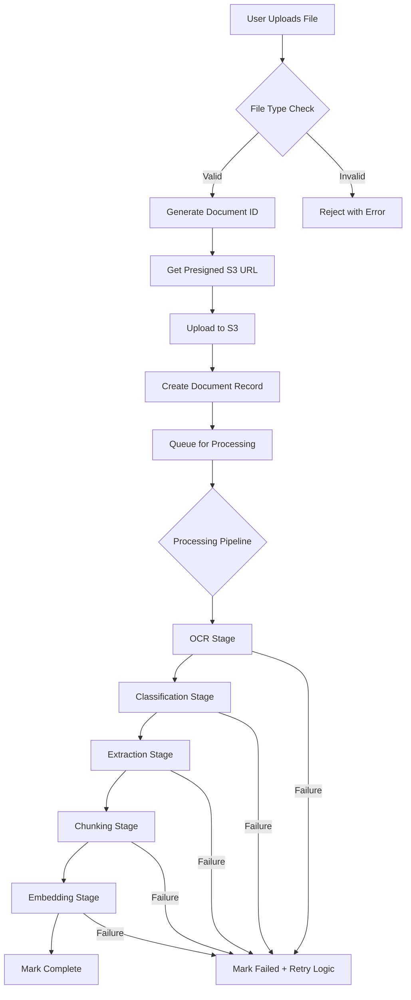
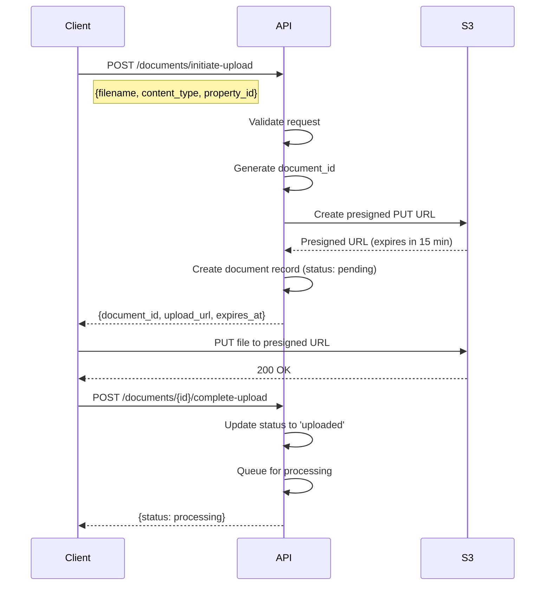
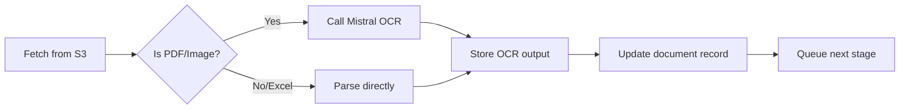
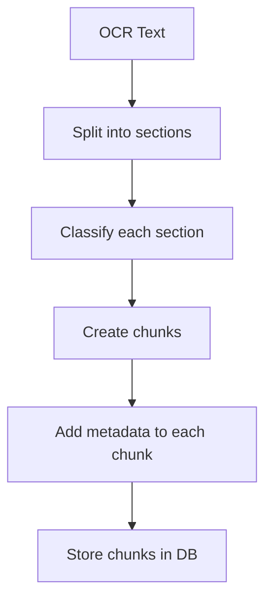
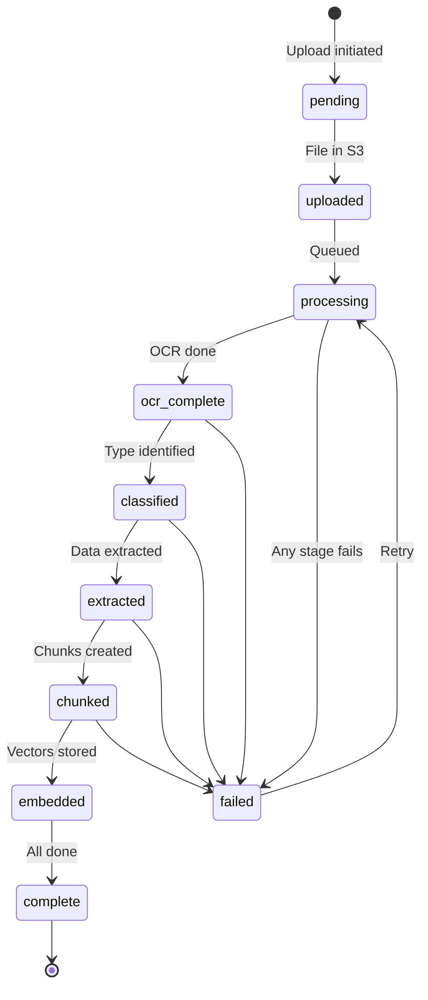
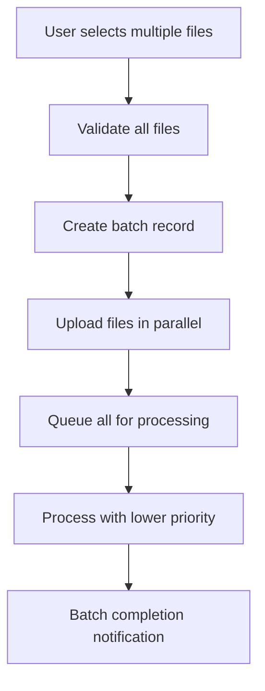

# Data Ingestion Pipeline

## Overview

This document describes how documents flow into the Open Insurance platform — from upload to storage. The ingestion pipeline is designed to be:

- **Robust** — Handle various file formats and sizes
- **Traceable** — Every document has clear provenance
- **Resumable** — Failures don't lose work
- **Observable** — Clear status at every stage

---

## Ingestion Flow



---

## Stage 1: Upload Initiation

### Supported File Types

| File Type | Extension | Handling |
|-----------|-----------|----------|
| PDF | .pdf | OCR → Extract |
| Excel | .xlsx, .xls | Direct parse |
| CSV | .csv | Direct parse |
| Image | .png, .jpg, .jpeg, .tiff | OCR → Extract |
| Word | .docx | Convert → OCR |

### File Validation

Before accepting a file:

```
┌─────────────────────────────────────────────────────────────┐
│                    VALIDATION CHECKS                         │
├─────────────────────────────────────────────────────────────┤
│                                                             │
│  1. File size < 50MB                                        │
│  2. Extension in allowed list                               │
│  3. MIME type matches extension (magic bytes check)         │
│  4. Not a duplicate (hash check, optional)                  │
│  5. Property exists (if property_id provided)               │
│                                                             │
└─────────────────────────────────────────────────────────────┘
```

### Upload Flow (Presigned URL Pattern)

We use presigned URLs to upload directly to S3, reducing backend load:



### Why Presigned URLs?

| Approach | Pros | Cons |
|----------|------|------|
| Direct to API | Simple | Server memory pressure, timeout risk |
| Presigned to S3 | Scalable, reliable | Two-step process |
| Chunked upload | Handles huge files | Complex |

For insurance documents (mostly <10MB PDFs), presigned URLs hit the sweet spot.

---

## Stage 2: S3 Storage

### Bucket Structure

```
open-insurance-docs/
├── uploads/
│   └── {organization_id}/
│       └── {property_id}/
│           └── {document_id}/
│               ├── original.pdf          # Original file
│               └── original_metadata.json # Upload metadata
│
├── processed/
│   └── {document_id}/
│       ├── ocr_output.md                 # Mistral OCR output
│       ├── ocr_output.json               # Structured OCR (if available)
│       ├── extraction_result.json        # LLM extraction output
│       └── chunks/
│           ├── chunk_000.json
│           ├── chunk_001.json
│           └── ...
│
└── exports/
    └── {export_id}/
        └── report.pdf
```

### Storage Metadata

Each uploaded file gets metadata stored alongside:

```json
{
  "document_id": "uuid",
  "original_filename": "Policy_2024.pdf",
  "content_type": "application/pdf",
  "file_size_bytes": 1234567,
  "uploaded_at": "2024-01-15T10:30:00Z",
  "uploaded_by": "user_uuid",
  "property_id": "uuid",
  "checksum_sha256": "abc123..."
}
```

---

## Stage 3: Processing Queue

### Why Queue?

Processing is I/O-heavy (OCR, LLM calls). Queuing allows:
- Async processing without blocking uploads
- Retry on failure
- Rate limiting to external services
- Priority handling (urgent vs batch)

### Queue Design (MVP)

For MVP, we use a simple database-backed queue:

```sql
-- Processing jobs table acts as queue
CREATE TABLE processing_jobs (
    id UUID PRIMARY KEY DEFAULT gen_random_uuid(),
    document_id UUID NOT NULL REFERENCES documents(id),

    -- Job details
    job_type TEXT NOT NULL,              -- 'ocr', 'classify', 'extract', 'chunk', 'embed'
    status TEXT DEFAULT 'pending',       -- 'pending', 'processing', 'completed', 'failed'
    priority INTEGER DEFAULT 5,          -- 1 = highest, 10 = lowest

    -- Execution tracking
    attempts INTEGER DEFAULT 0,
    max_attempts INTEGER DEFAULT 3,
    last_error TEXT,

    -- Timing
    created_at TIMESTAMP WITH TIME ZONE DEFAULT NOW(),
    started_at TIMESTAMP WITH TIME ZONE,
    completed_at TIMESTAMP WITH TIME ZONE,

    -- Lock for worker claiming
    locked_by TEXT,
    locked_at TIMESTAMP WITH TIME ZONE
);

CREATE INDEX idx_jobs_pending ON processing_jobs(status, priority, created_at)
    WHERE status = 'pending';
```

### Queue Scaling (Future)

When we outgrow database-backed queue:

| Option | Use Case |
|--------|----------|
| Redis + Bull | Simple, works well to ~1000 jobs/hour |
| AWS SQS | Managed, scales infinitely |
| Celery | If we need complex workflows |

---

## Stage 4: Processing Pipeline

Each document goes through these stages in order:

### 4.1 OCR Stage

**Input:** Raw file from S3
**Output:** Markdown text with tables



**Mistral OCR Call:**

```
POST https://api.mistral.ai/v1/ocr

Request:
{
  "model": "mistral-ocr-3",
  "document": {
    "type": "pdf",
    "data": "<base64_encoded_pdf>"
  }
}

Response:
{
  "content": "# Policy Document\n\n## Coverage Schedule\n\n| Coverage | Limit | Deductible |\n|...|...|...|\n\n..."
}
```

**Error Handling:**

| Error | Action |
|-------|--------|
| API timeout | Retry with exponential backoff |
| Rate limit | Queue with delay |
| Invalid PDF | Mark failed, notify user |
| OCR quality low | Continue with warning flag |

### 4.2 Classification Stage

**Input:** OCR text
**Output:** Document type and subtype


**Classification Prompt:**

```
Analyze this insurance document and classify it.

Document text:
{first_5000_chars_of_ocr}

Respond with JSON:
{
  "document_type": "policy | coi | eop | invoice | sov | loss_run | proposal | endorsement | other",
  "document_subtype": "property_policy | gl_policy | umbrella_policy | excess_policy | flood_policy | ...",
  "confidence": 0.0-1.0,
  "carrier_name": "detected carrier or null",
  "policy_number": "detected policy number or null",
  "effective_date": "YYYY-MM-DD or null",
  "expiration_date": "YYYY-MM-DD or null"
}
```

**Why Classify First?**

| Without Classification | With Classification |
|------------------------|---------------------|
| One giant extraction schema | Focused, accurate schemas |
| LLM hallucinates irrelevant fields | Only extracts what exists |
| Harder to validate | Validation per type |

### 4.3 Extraction Stage

**Input:** OCR text + document type
**Output:** Structured data matching type schema

Covered in detail in [04-extraction-pipeline.md](./04-extraction-pipeline.md).

### 4.4 Chunking Stage

**Input:** OCR text + classification
**Output:** Semantic chunks with metadata



**Chunking Strategy:**

```
┌─────────────────────────────────────────────────────────────┐
│                    CHUNKING RULES                            │
├─────────────────────────────────────────────────────────────┤
│                                                             │
│  1. Respect section boundaries (headers, page breaks)       │
│  2. Target chunk size: 500-1000 tokens                      │
│  3. Overlap: 50 tokens between chunks                       │
│  4. Keep tables intact (don't split mid-table)              │
│  5. Classify each chunk (coverage, exclusion, etc.)         │
│                                                             │
└─────────────────────────────────────────────────────────────┘
```

**Chunk Classification:**

| Chunk Type | Detection Signals |
|------------|-------------------|
| `coverage` | "Coverage", "Limit", "$", numbers |
| `exclusion` | "Exclusion", "does not cover", "except" |
| `condition` | "Condition", "must", "shall", "required" |
| `definition` | "means", "defined as", quotes |
| `endorsement` | "Endorsement", "amends", "modifies" |
| `general` | Everything else |

### 4.5 Embedding Stage

**Input:** Chunks with metadata
**Output:** Vectors in Pinecone


**Batching:**

- OpenAI allows up to 2048 embeddings per call
- We batch in groups of 100 for reliability
- Retry failed batches individually

**Pinecone Upsert:**

```json
{
  "vectors": [
    {
      "id": "chunk_uuid",
      "values": [0.1, 0.2, ...],
      "metadata": {
        "document_id": "uuid",
        "property_id": "uuid",
        "document_type": "policy",
        "policy_type": "property",
        "chunk_type": "exclusion",
        "page_number": 12,
        "carrier": "Seneca Insurance"
      }
    }
  ]
}
```

---

## Status Tracking

### Document Status Flow



### Status Fields on Document Record

```sql
-- documents table status fields
upload_status TEXT       -- 'pending', 'uploaded', 'failed'
ocr_status TEXT          -- 'pending', 'processing', 'completed', 'failed'
extraction_status TEXT   -- 'pending', 'processing', 'completed', 'failed', 'needs_review'
```

### Processing Timeline Example

```
Document: Policy_2024.pdf
────────────────────────────────────────────────────────────

10:30:00  Upload initiated
10:30:01  Presigned URL generated
10:30:05  File uploaded to S3 (2.3 MB)
10:30:05  Document record created (status: uploaded)
10:30:06  Queued for processing

10:30:10  OCR started
10:30:25  OCR completed (15 seconds, 45 pages)

10:30:26  Classification started
10:30:28  Classified as: property_policy (confidence: 0.97)

10:30:29  Extraction started
10:30:45  Extraction completed
          - 1 policy record created
          - 8 coverage records created
          - Confidence: 0.92

10:30:46  Chunking started
10:30:48  Created 23 chunks

10:30:49  Embedding started
10:30:52  Embedded 23 chunks to Pinecone

10:30:52  Document marked complete
────────────────────────────────────────────────────────────
Total time: 52 seconds
```

---

## Error Handling

### Retry Strategy

```
┌─────────────────────────────────────────────────────────────┐
│                    RETRY POLICY                              │
├─────────────────────────────────────────────────────────────┤
│                                                             │
│  Attempt 1: Immediate                                       │
│  Attempt 2: After 1 minute                                  │
│  Attempt 3: After 5 minutes                                 │
│  Attempt 4: After 30 minutes (final)                        │
│                                                             │
│  After 4 failures: Mark as 'failed', notify user            │
│                                                             │
└─────────────────────────────────────────────────────────────┘
```

### Error Categories

| Category | Example | Handling |
|----------|---------|----------|
| **Transient** | API timeout, rate limit | Retry with backoff |
| **Document** | Corrupted PDF, password-protected | Mark failed, user action needed |
| **Extraction** | Low confidence, missing data | Flag for review |
| **System** | Out of memory, disk full | Alert ops, pause processing |

### User Notifications

When processing fails:

```json
{
  "type": "document_processing_failed",
  "document_id": "uuid",
  "document_name": "Policy_2024.pdf",
  "error_type": "corrupted_pdf",
  "error_message": "Unable to read PDF. The file may be corrupted or password-protected.",
  "suggestions": [
    "Try re-uploading the file",
    "Ensure the PDF is not password-protected",
    "Try exporting as a new PDF from the source application"
  ]
}
```

---

## Batch Upload

For initial onboarding with many documents:

### Batch Upload Flow



### Batch Considerations

- Lower priority than single uploads (priority = 7 vs 5)
- Progress tracking at batch level
- Single notification when all complete
- Can pause/cancel batch

---

## Reprocessing

Documents can be reprocessed when:

1. **Extraction logic improves** — New schemas, better prompts
2. **User requests** — "Try again with this document"
3. **Data correction** — User corrects something, need to re-extract

### Reprocessing Flow


**What We Keep:**
- Original file in S3
- OCR output (unless OCR model changed)

**What We Clear:**
- Extracted records (policies, coverages, etc.)
- Chunks and embeddings
- Confidence scores

---

## Monitoring & Observability

### Key Metrics

| Metric | Description | Alert Threshold |
|--------|-------------|-----------------|
| `ingestion.upload.count` | Files uploaded per hour | N/A |
| `ingestion.processing.duration` | Time to process document | > 5 minutes |
| `ingestion.ocr.duration` | OCR step time | > 60 seconds |
| `ingestion.extraction.confidence` | Average extraction confidence | < 0.80 |
| `ingestion.queue.depth` | Pending jobs | > 100 |
| `ingestion.failure.rate` | % of documents failing | > 5% |

### Logging

Each processing step logs:

```json
{
  "timestamp": "2024-01-15T10:30:25Z",
  "level": "info",
  "event": "ocr_completed",
  "document_id": "uuid",
  "property_id": "uuid",
  "duration_ms": 15234,
  "page_count": 45,
  "output_size_bytes": 125000
}
```

---

## Security Considerations

### File Validation

```
┌─────────────────────────────────────────────────────────────┐
│                  SECURITY CHECKS                             │
├─────────────────────────────────────────────────────────────┤
│                                                             │
│  1. Magic byte validation (not just extension)              │
│  2. Max file size enforcement                               │
│  3. Virus scan (future: integrate with ClamAV)              │
│  4. PDF parsing validation (catch malformed PDFs)           │
│  5. No executable content allowed                           │
│                                                             │
└─────────────────────────────────────────────────────────────┘
```

### Access Control

- Presigned URLs expire in 15 minutes
- Documents only accessible by organization members
- S3 bucket is private, no public access
- All access logged

---

## Performance Optimization

### Parallel Processing

For a single document:
- OCR and classification are sequential
- Multiple extraction schemas could run in parallel (future)
- Chunk embedding is batched

For multiple documents:
- Multiple documents process in parallel
- Limited by external API rate limits

### Caching

| What | How Long | Why |
|------|----------|-----|
| OCR results | Forever | Expensive, won't change |
| Classification | Forever | Deterministic |
| Embeddings | Forever | Document doesn't change |

### Rate Limiting

| Service | Rate Limit | Our Limit |
|---------|------------|-----------|
| Mistral OCR | 60 req/min | 30 req/min (50% buffer) |
| Gemini | 60 req/min | 40 req/min |
| OpenAI Embeddings | 10,000 req/min | 1,000 req/min |

---

## Key Decisions

| Decision | Choice | Rationale |
|----------|--------|-----------|
| Presigned URLs for upload | Yes | Scalable, reduces server load |
| Database-backed queue (MVP) | Yes | Simple, good enough for MVP volume |
| Store OCR output | Yes | Enables reprocessing without re-OCR |
| Sequential processing stages | Yes | Simpler error handling, clear status |
| Chunk before embed | Yes | Better retrieval, can update schema |

---

## Next Steps

Proceed to [04-extraction-pipeline.md](./04-extraction-pipeline.md) to understand how we convert OCR output into structured data.