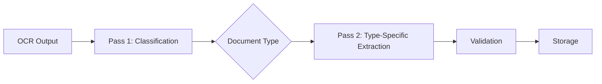
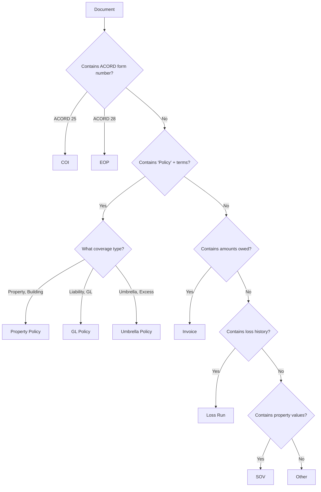
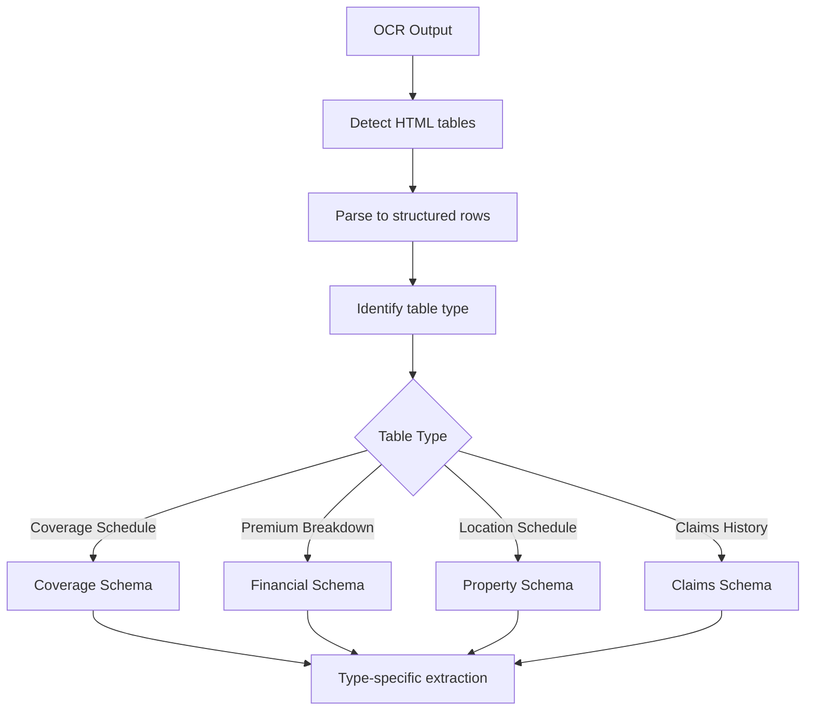
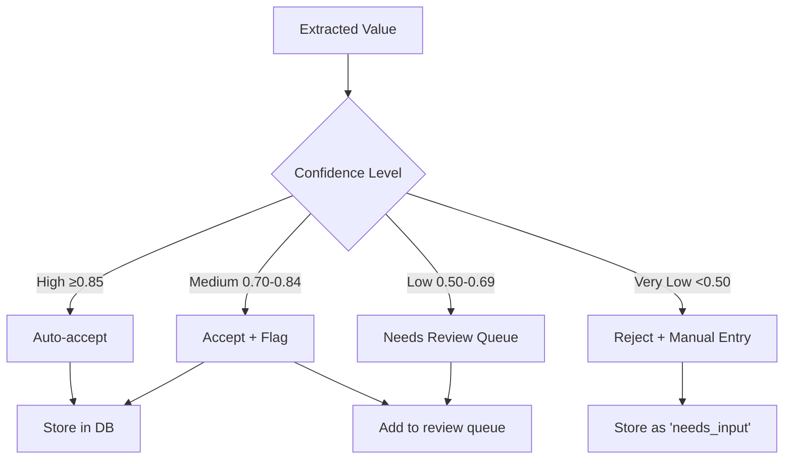
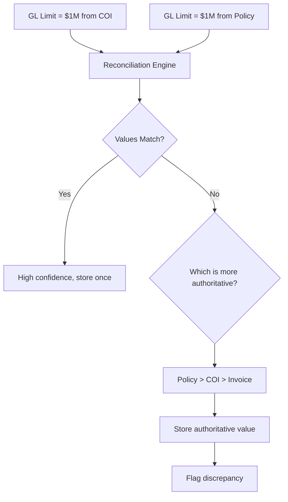
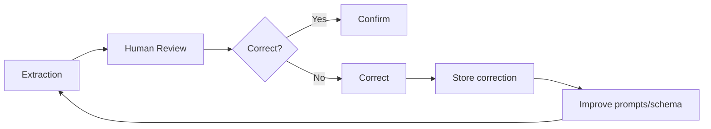

# Extraction Pipeline

## Overview

This document describes how we convert unstructured OCR output into structured database records. The extraction pipeline is the core intelligence of the system — it transforms "a 50-page PDF" into "a property policy with 8 coverages, 3 endorsements, expiring in 60 days."

---

## Extraction Philosophy

### Principles

1. **Schema-first extraction** — We define what we want before asking the LLM
2. **Type-specific schemas** — Different schemas for policies, COIs, invoices
3. **Confidence tracking** — Every extracted value has a confidence score
4. **Provenance** — Every value traces back to source page
5. **Graceful degradation** — Extract what we can, flag what we can't

### The Two-Pass Approach



**Why two passes?**

| Single Pass | Two Pass |
|-------------|----------|
| One giant schema | Focused, accurate schemas |
| Hallucinates missing fields | Only extracts what exists |
| 70-80% accuracy | 90-95% accuracy |
| Hard to debug | Clear failure points |

---

## Pass 1: Document Classification

### Classification Schema

```python
from pydantic import BaseModel
from typing import Optional
from enum import Enum

class DocumentType(str, Enum):
    POLICY = "policy"
    COI = "coi"
    EOP = "eop"
    INVOICE = "invoice"
    SOV = "sov"
    LOSS_RUN = "loss_run"
    PROPOSAL = "proposal"
    ENDORSEMENT = "endorsement"
    OTHER = "other"

class PolicySubtype(str, Enum):
    PROPERTY = "property_policy"
    GENERAL_LIABILITY = "gl_policy"
    UMBRELLA = "umbrella_policy"
    EXCESS = "excess_policy"
    FLOOD = "flood_policy"
    EARTHQUAKE = "earthquake_policy"
    AUTO = "auto_policy"
    WORKERS_COMP = "workers_comp_policy"
    PACKAGE = "package_policy"  # Combined property + liability

class DocumentClassification(BaseModel):
    document_type: DocumentType
    document_subtype: Optional[str] = None
    confidence: float

    # Quick metadata extraction
    carrier_name: Optional[str] = None
    policy_number: Optional[str] = None
    effective_date: Optional[str] = None  # YYYY-MM-DD
    expiration_date: Optional[str] = None
    insured_name: Optional[str] = None
```

### Classification Prompt

```
You are an insurance document classifier. Analyze the following document
and classify it.

Document text (first 5000 characters):
---
{ocr_text[:5000]}
---

Classification rules:
- "policy" = Full insurance policy with terms and conditions
- "coi" = Certificate of Insurance (ACORD 25 or similar)
- "eop" = Evidence of Property Insurance (ACORD 28 or similar)
- "invoice" = Bill for premium payment
- "sov" = Statement of Values / Property schedule
- "loss_run" = Claims history report
- "proposal" = Quote or proposal from broker/carrier
- "endorsement" = Policy modification document
- "other" = None of the above

For policies, also identify the subtype:
- "property_policy" = Covers building and contents
- "gl_policy" = General Liability
- "umbrella_policy" = Umbrella or Excess Liability
- etc.

Respond with valid JSON matching this schema:
{schema}
```

### Classification Decision Tree



---

## Pass 2: Type-Specific Extraction

Each document type has its own extraction schema and prompt.

### Property Policy Extraction

```python
class PropertyCoverage(BaseModel):
    coverage_name: str                    # "Building", "Business Income"
    limit_amount: Optional[float] = None
    limit_type: Optional[str] = None      # "per_occurrence", "blanket"
    deductible_amount: Optional[float] = None
    deductible_type: Optional[str] = None # "flat", "percentage"
    deductible_percentage: Optional[float] = None
    coinsurance_percentage: Optional[float] = None
    valuation_type: Optional[str] = None  # "replacement_cost", "ACV"
    waiting_period_hours: Optional[int] = None
    confidence: float
    source_page: Optional[int] = None

class PropertyPolicyExtraction(BaseModel):
    # Policy identification
    policy_number: Optional[str] = None
    carrier_name: Optional[str] = None
    effective_date: Optional[str] = None
    expiration_date: Optional[str] = None

    # Named insured
    named_insured: Optional[str] = None
    insured_address: Optional[str] = None

    # Premium
    premium: Optional[float] = None
    taxes: Optional[float] = None
    fees: Optional[float] = None
    total_premium: Optional[float] = None

    # Policy characteristics
    admitted: Optional[bool] = None
    policy_form: Optional[str] = None     # "ISO", "manuscript"

    # Coverages
    coverages: list[PropertyCoverage] = []

    # Property details (if included)
    property_address: Optional[str] = None
    building_value: Optional[float] = None
    contents_value: Optional[float] = None
    total_insured_value: Optional[float] = None

    # Overall confidence
    extraction_confidence: float
```

### Property Policy Prompt

```
You are an expert insurance document analyzer. Extract structured data
from this property insurance policy.

Policy document:
---
{ocr_text}
---

Extract the following information. For each field:
- If clearly stated, extract the value
- If unclear or not found, set to null
- Assign a confidence score (0.0-1.0) based on clarity
- Note the page number where found

Focus on:
1. Policy identification (number, carrier, dates)
2. Named insured information
3. Premium breakdown
4. All coverage limits and deductibles
5. Property values

Common coverage names to look for:
- Building / Dwelling
- Contents / Business Personal Property
- Business Income / Loss of Rents
- Extra Expense
- Ordinance or Law
- Equipment Breakdown

Respond with valid JSON matching this schema:
{schema}
```

### General Liability Policy Extraction

```python
class LiabilityCoverage(BaseModel):
    coverage_name: str
    limit_amount: Optional[float] = None
    limit_type: str                       # "each_occurrence", "aggregate", "per_person"
    deductible_amount: Optional[float] = None
    confidence: float
    source_page: Optional[int] = None

class GLPolicyExtraction(BaseModel):
    policy_number: Optional[str] = None
    carrier_name: Optional[str] = None
    effective_date: Optional[str] = None
    expiration_date: Optional[str] = None

    named_insured: Optional[str] = None

    premium: Optional[float] = None

    # Standard GL limits
    each_occurrence_limit: Optional[float] = None
    general_aggregate_limit: Optional[float] = None
    products_completed_limit: Optional[float] = None
    personal_advertising_limit: Optional[float] = None
    damage_to_rented_premises: Optional[float] = None
    medical_expense_limit: Optional[float] = None

    # Form type
    occurrence_form: Optional[bool] = None  # vs claims-made
    retroactive_date: Optional[str] = None  # For claims-made

    # Additional coverages
    coverages: list[LiabilityCoverage] = []

    extraction_confidence: float
```

### Certificate of Insurance (COI) Extraction

```python
class COIExtraction(BaseModel):
    certificate_number: Optional[str] = None
    issue_date: Optional[str] = None

    # Certificate holder
    holder_name: Optional[str] = None
    holder_address: Optional[str] = None

    # Insured
    insured_name: Optional[str] = None
    insured_address: Optional[str] = None

    # Policy information (summary)
    policies: list[COIPolicyInfo] = []

    # Standard limits shown
    gl_each_occurrence: Optional[float] = None
    gl_general_aggregate: Optional[float] = None
    gl_products_completed: Optional[float] = None
    gl_personal_advertising: Optional[float] = None
    gl_damage_to_rented: Optional[float] = None
    gl_medical_expense: Optional[float] = None

    auto_combined_single: Optional[float] = None

    umbrella_each_occurrence: Optional[float] = None
    umbrella_aggregate: Optional[float] = None

    workers_comp_each_accident: Optional[float] = None
    workers_comp_disease_employee: Optional[float] = None
    workers_comp_disease_policy: Optional[float] = None

    property_limit: Optional[float] = None

    extraction_confidence: float

class COIPolicyInfo(BaseModel):
    policy_type: str                      # "GL", "Auto", "Umbrella", "Property"
    carrier_name: Optional[str] = None
    policy_number: Optional[str] = None
    effective_date: Optional[str] = None
    expiration_date: Optional[str] = None
```

### Invoice Extraction

```python
class InvoiceLineItem(BaseModel):
    description: str
    amount: float
    item_type: Optional[str] = None       # "premium", "tax", "fee"

class InvoiceExtraction(BaseModel):
    invoice_number: Optional[str] = None
    invoice_date: Optional[str] = None
    due_date: Optional[str] = None

    carrier_name: Optional[str] = None
    policy_number: Optional[str] = None

    # Amounts
    line_items: list[InvoiceLineItem] = []
    premium: Optional[float] = None
    taxes: Optional[float] = None
    fees: Optional[float] = None
    broker_commission: Optional[float] = None
    surplus_lines_tax: Optional[float] = None
    stamping_fee: Optional[float] = None
    total_due: Optional[float] = None

    extraction_confidence: float
```

### Loss Run Extraction

```python
class ClaimRecord(BaseModel):
    claim_number: Optional[str] = None
    date_of_loss: Optional[str] = None
    date_reported: Optional[str] = None
    claim_type: Optional[str] = None      # "property", "liability"
    cause_of_loss: Optional[str] = None
    description: Optional[str] = None
    amount_paid: Optional[float] = None
    amount_reserved: Optional[float] = None
    amount_incurred: Optional[float] = None
    status: Optional[str] = None          # "open", "closed"
    confidence: float

class LossRunExtraction(BaseModel):
    report_date: Optional[str] = None
    carrier_name: Optional[str] = None
    policy_number: Optional[str] = None
    insured_name: Optional[str] = None

    # Period covered
    period_start: Optional[str] = None
    period_end: Optional[str] = None

    # Claims
    claims: list[ClaimRecord] = []

    # Summary
    total_claims: Optional[int] = None
    total_paid: Optional[float] = None
    total_reserved: Optional[float] = None
    total_incurred: Optional[float] = None

    extraction_confidence: float
```

---

## Table Extraction

Insurance documents are table-heavy. We handle tables specially.

### Table Detection

Mistral OCR outputs tables as HTML within markdown:

```markdown
## Coverage Schedule

<table>
<tr><th>Coverage</th><th>Limit</th><th>Deductible</th></tr>
<tr><td>Building</td><td>$35,989,980</td><td>$50,000</td></tr>
<tr><td>Business Income</td><td>$2,500,000</td><td>72 hours</td></tr>
</table>
```

### Table Parsing Strategy



### Table-Aware Prompt

```
The document contains tables. Here are the tables extracted:

Table 1 (Page 5):
| Coverage | Limit | Deductible |
|----------|-------|------------|
| Building | $35,989,980 | $50,000 |
| Business Income | $2,500,000 | 72 hours |

Table 2 (Page 8):
| Description | Amount |
|-------------|--------|
| Base Premium | $125,000 |
| Taxes | $7,500 |
| Fees | $1,200 |

Use these tables as the primary source for coverage limits and financial data.
The surrounding text provides context but tables are more accurate for numbers.
```

---

## Validation Layer

After LLM extraction, we validate before storing.

### Validation Rules

```python
class ExtractionValidator:
    def validate_policy(self, data: PropertyPolicyExtraction) -> ValidationResult:
        errors = []
        warnings = []

        # Date validation
        if data.effective_date and data.expiration_date:
            if data.effective_date > data.expiration_date:
                errors.append("Effective date after expiration date")

        # Premium sanity check
        if data.premium:
            if data.premium < 100:
                warnings.append("Premium unusually low (<$100)")
            if data.premium > 10_000_000:
                warnings.append("Premium unusually high (>$10M)")

        # Coverage limit sanity checks
        for coverage in data.coverages:
            if coverage.limit_amount:
                if coverage.limit_amount < 1000:
                    warnings.append(f"{coverage.coverage_name} limit unusually low")
                if coverage.limit_amount > 1_000_000_000:
                    warnings.append(f"{coverage.coverage_name} limit unusually high")

            # Percentage deductible validation
            if coverage.deductible_type == "percentage":
                if coverage.deductible_percentage:
                    if coverage.deductible_percentage > 25:
                        warnings.append(f"{coverage.coverage_name} deductible >25%")

        # Cross-field validation
        if data.total_premium:
            calculated = (data.premium or 0) + (data.taxes or 0) + (data.fees or 0)
            if abs(calculated - data.total_premium) > 100:
                warnings.append("Total premium doesn't match sum of components")

        return ValidationResult(
            valid=len(errors) == 0,
            errors=errors,
            warnings=warnings
        )
```

### Confidence Thresholds

| Confidence | Action |
|------------|--------|
| ≥ 0.95 | Auto-accept, high confidence |
| 0.85 - 0.94 | Auto-accept, flag for spot-check |
| 0.70 - 0.84 | Accept with warning, show in review queue |
| 0.50 - 0.69 | Needs human review |
| < 0.50 | Likely wrong, require manual entry |

### Handling Low Confidence



---

## Multi-Document Reconciliation

The same fact may appear in multiple documents. We reconcile.

### Reconciliation Strategy



### Source Authority Hierarchy

| Rank | Source | Why |
|------|--------|-----|
| 1 | Policy | Legal contract, most authoritative |
| 2 | Endorsement | Modifies policy |
| 3 | EOP/COI | Summary, may lag |
| 4 | Invoice | Financial only |
| 5 | Proposal/Quote | Pre-bind, may differ |

### Reconciliation Example

```
Property: Buffalo Run
Field: GL Each Occurrence Limit

Sources:
- Policy (page 12): $1,000,000 (confidence: 0.95)
- COI (page 1): $1,000,000 (confidence: 0.92)
- Invoice: not mentioned

Result:
- Value: $1,000,000
- Combined confidence: 0.97 (corroborated)
- Sources: [Policy p.12, COI p.1]
- Conflicts: None
```

---

## Handling Extraction Failures

### Failure Categories

| Category | Example | Response |
|----------|---------|----------|
| **Complete failure** | LLM returns invalid JSON | Retry with different prompt |
| **Partial extraction** | Got policy number, missed limits | Store what we got, flag incomplete |
| **Low confidence** | Extracted but unsure | Store with low confidence, queue for review |
| **Contradiction** | Two values for same field | Flag conflict, use authority hierarchy |

### Retry Logic

```python
async def extract_with_retry(document: Document, max_attempts: int = 3):
    for attempt in range(max_attempts):
        try:
            result = await extract(document)

            if result.extraction_confidence >= 0.5:
                return result

            # Low confidence, try with more specific prompt
            if attempt < max_attempts - 1:
                continue

        except ExtractionError as e:
            if attempt == max_attempts - 1:
                raise

            # Modify prompt based on error
            await asyncio.sleep(2 ** attempt)  # Exponential backoff

    return PartialExtractionResult(
        extracted=result,
        needs_review=True,
        failure_reason="Low confidence after retries"
    )
```

---

## Performance Optimization

### Batching

For multiple documents:

```python
# Process in parallel with semaphore for rate limiting
async def process_batch(documents: list[Document], concurrency: int = 5):
    semaphore = asyncio.Semaphore(concurrency)

    async def process_one(doc):
        async with semaphore:
            return await extract_document(doc)

    results = await asyncio.gather(*[process_one(doc) for doc in documents])
    return results
```

### Caching

```
┌─────────────────────────────────────────────────────────────┐
│                    CACHING STRATEGY                          │
├─────────────────────────────────────────────────────────────┤
│                                                             │
│  Cache Key: hash(document_content + schema_version)         │
│                                                             │
│  Cached:                                                    │
│  - Classification results (permanent)                       │
│  - Extraction results (until schema changes)                │
│                                                             │
│  Not Cached:                                                │
│  - Validation results (may change with new rules)           │
│  - Reconciliation (depends on other documents)              │
│                                                             │
└─────────────────────────────────────────────────────────────┘
```

### Token Optimization

Insurance documents can be long. Strategies:

| Strategy | When | Savings |
|----------|------|---------|
| Truncate boilerplate | Always | 20-30% |
| Extract tables separately | Complex tables | Variable |
| Chunk long documents | >100 pages | Necessary |
| Skip known-useless pages | Signature pages | 5-10% |

---

## Schema Versioning

Extraction schemas will evolve. We version them.

### Version Tracking

```python
SCHEMA_VERSIONS = {
    "property_policy": "1.2.0",
    "gl_policy": "1.1.0",
    "coi": "1.0.0",
    "invoice": "1.0.0",
}

class ExtractionMetadata(BaseModel):
    schema_type: str
    schema_version: str
    extracted_at: datetime
    model_used: str  # "gemini-2.5-flash"
    prompt_version: str
```

### Migration on Schema Change

When schema changes:

1. Bump version number
2. New documents use new schema
3. Backfill: Re-extract existing documents with new schema
4. Keep old extractions for comparison/rollback

---

## Monitoring & Quality

### Extraction Metrics

| Metric | Description | Target |
|--------|-------------|--------|
| `extraction.success_rate` | % completing without error | >98% |
| `extraction.avg_confidence` | Mean confidence score | >0.85 |
| `extraction.needs_review_rate` | % flagged for review | <10% |
| `extraction.duration_p95` | 95th percentile time | <30s |

### Quality Feedback Loop



---

## Key Decisions

| Decision | Choice | Rationale |
|----------|--------|-----------|
| Two-pass extraction | Yes | Better accuracy, clearer debugging |
| Type-specific schemas | Yes | Prevents hallucination |
| Pydantic for schemas | Yes | Works with both Python and LLM |
| Store raw extraction | Yes | Enables reprocessing, debugging |
| Confidence per field | Yes | Granular quality tracking |

---

## Next Steps

Proceed to [05-rag-system.md](./05-rag-system.md) to understand how we answer natural language questions.