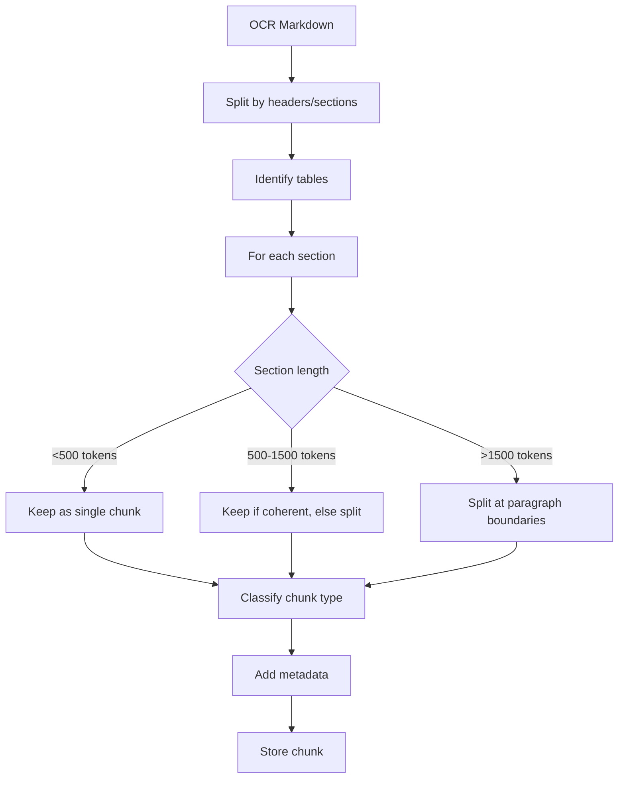
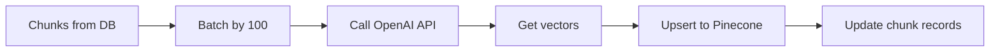
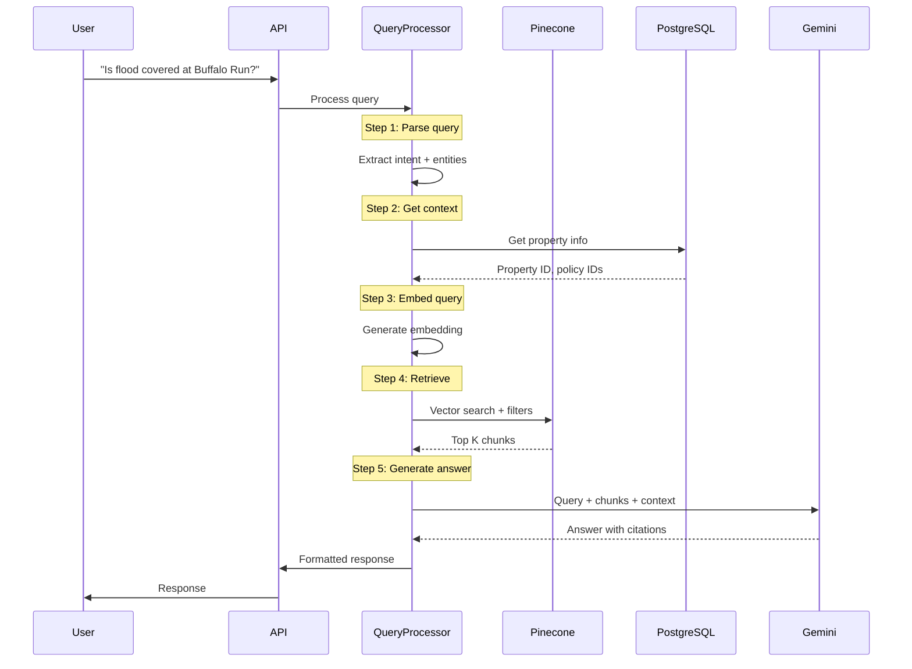
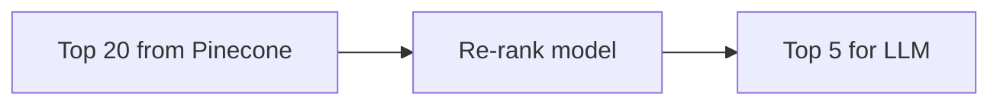
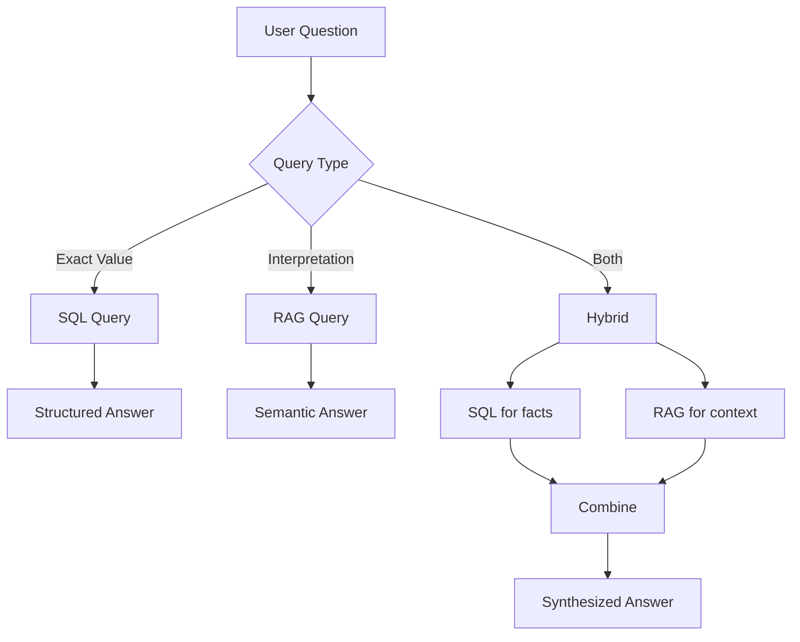
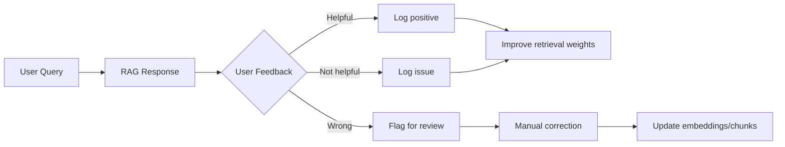

# RAG System

## Overview

The RAG (Retrieval-Augmented Generation) system enables natural language questions about insurance coverage. Users can ask questions like "Is flood covered at Buffalo Run?" and get accurate answers with citations.

This document covers:
- Chunking strategy
- Embedding and storage
- Retrieval logic
- Answer generation
- Quality and evaluation

---

## Why RAG?

### Structured Data vs RAG

We have two data layers:

| Layer | Storage | Best For |
|-------|---------|----------|
| **Structured** | PostgreSQL | "What's my GL limit?" (exact values) |
| **Semantic** | Pinecone | "Am I covered if a pipe bursts?" (interpretation) |

**Structured data answers:** What, how much, when?
**RAG answers:** Am I covered? What does this mean? Why?

### Example Questions by Type

| Question | Approach |
|----------|----------|
| "What's my property limit at Shoaff Park?" | SQL query |
| "When does my policy expire?" | SQL query |
| "Is flood covered?" | RAG (need to check policy language) |
| "What's excluded from my coverage?" | RAG (need exclusion text) |
| "What happens if a tenant sues me?" | RAG (need liability terms) |

---

## Chunking Strategy

### Why Chunking Matters

Poor chunking = poor retrieval = bad answers.

```
┌─────────────────────────────────────────────────────────────┐
│                  CHUNKING PRINCIPLES                         │
├─────────────────────────────────────────────────────────────┤
│                                                             │
│  1. Semantic coherence > arbitrary length                   │
│  2. Respect document structure (sections, headers)          │
│  3. Keep tables intact                                      │
│  4. Include enough context to be standalone                 │
│  5. Classify chunks for filtered retrieval                  │
│                                                             │
└─────────────────────────────────────────────────────────────┘
```

### Chunk Types

| Type | Content | Retrieval Priority |
|------|---------|-------------------|
| `coverage` | Coverage descriptions, limits | High |
| `exclusion` | What's NOT covered | High |
| `condition` | Requirements to maintain coverage | Medium |
| `definition` | Terms and meanings | Medium |
| `endorsement` | Policy modifications | High |
| `general` | Boilerplate, contact info | Low |

### Chunking Algorithm



### Chunking Configuration

```python
class ChunkingConfig:
    # Size targets
    min_chunk_tokens: int = 100
    target_chunk_tokens: int = 500
    max_chunk_tokens: int = 1000
    overlap_tokens: int = 50

    # Splitting rules
    split_on_headers: bool = True
    keep_tables_intact: bool = True
    respect_paragraphs: bool = True

    # Classification
    classify_chunks: bool = True
```

### Example Chunking

**Input (OCR output):**
```markdown
# Section I - Property Coverage

## Coverage A - Building

We cover direct physical loss to the building described in
the Declarations. Building means the building structure and...

## Exclusions

We do not cover loss or damage caused by:
1. Earth movement
2. Flood
3. Nuclear hazard
...
```

**Output (chunks):**
```json
[
  {
    "id": "chunk_001",
    "text": "# Section I - Property Coverage\n\n## Coverage A - Building\n\nWe cover direct physical loss to the building described in the Declarations. Building means the building structure and...",
    "chunk_type": "coverage",
    "section_title": "Coverage A - Building",
    "page_start": 12,
    "page_end": 12,
    "token_count": 450
  },
  {
    "id": "chunk_002",
    "text": "## Exclusions\n\nWe do not cover loss or damage caused by:\n1. Earth movement\n2. Flood\n3. Nuclear hazard...",
    "chunk_type": "exclusion",
    "section_title": "Exclusions",
    "page_start": 15,
    "page_end": 16,
    "token_count": 380
  }
]
```

---

## Embedding & Storage

### Embedding Model

**Model:** OpenAI `text-embedding-3-small`

| Property | Value |
|----------|-------|
| Dimensions | 1536 |
| Max tokens | 8191 |
| Cost | $0.02 / 1M tokens |
| Quality | Good for document search |

### Embedding Process



### Pinecone Index Configuration

```python
pinecone_index_config = {
    "name": "insurance-docs",
    "dimension": 1536,
    "metric": "cosine",
    "spec": {
        "serverless": {
            "cloud": "aws",
            "region": "us-east-1"
        }
    }
}
```

### Metadata Schema

Each vector in Pinecone includes metadata for filtering:

```json
{
  "id": "chunk_uuid",
  "values": [0.123, -0.456, ...],
  "metadata": {
    "document_id": "uuid",
    "property_id": "uuid",
    "organization_id": "uuid",

    "document_type": "policy",
    "policy_type": "property",
    "chunk_type": "exclusion",

    "carrier": "Seneca Insurance",
    "effective_date": "2024-01-01",
    "expiration_date": "2025-01-01",

    "page_number": 15,
    "section_title": "Exclusions",

    "chunk_text": "We do not cover loss or damage caused by..."
  }
}
```

### Why This Metadata?

| Metadata Field | Enables |
|----------------|---------|
| `property_id` | "Search only this property's docs" |
| `document_type` | "Search only policies" |
| `chunk_type` | "Search only exclusions" |
| `effective_date` | "Search only current policies" |
| `chunk_text` | Include text in response without DB lookup |

---

## Retrieval Logic

### Query Flow



### Query Parsing

Before retrieval, we parse the query to extract:

```python
class ParsedQuery:
    original_query: str
    intent: str                    # "coverage_check", "limit_lookup", "explanation"
    property_name: Optional[str]   # "Buffalo Run"
    coverage_type: Optional[str]   # "flood", "wind", "liability"
    time_reference: Optional[str]  # "current", "2023"
    filters: dict                  # Extracted filter criteria
```

**Query parsing prompt:**

```
Parse this insurance question and extract structured information.

Question: "Is flood covered at Buffalo Run?"

Extract:
- intent: What does the user want to know?
- property_name: Which property (if mentioned)?
- coverage_type: What type of coverage?
- time_reference: Current or historical?

Respond with JSON.
```

### Filtered Retrieval

We filter BEFORE vector search for efficiency:

```python
async def retrieve_relevant_chunks(
    query: str,
    property_id: str,
    filters: Optional[dict] = None
) -> list[Chunk]:

    # Build Pinecone filter
    pinecone_filter = {
        "property_id": {"$eq": property_id}
    }

    # Add optional filters
    if filters:
        if filters.get("policy_type"):
            pinecone_filter["policy_type"] = {"$eq": filters["policy_type"]}
        if filters.get("chunk_type"):
            pinecone_filter["chunk_type"] = {"$in": filters["chunk_type"]}
        if filters.get("current_only"):
            pinecone_filter["expiration_date"] = {"$gte": today_str}

    # Embed query
    query_embedding = await embed_text(query)

    # Search Pinecone
    results = pinecone_index.query(
        vector=query_embedding,
        top_k=10,
        filter=pinecone_filter,
        include_metadata=True
    )

    return results.matches
```

### Retrieval Strategies by Query Type

| Query Type | Strategy |
|------------|----------|
| Coverage question | Filter: chunk_type = ["coverage", "exclusion"] |
| Limit lookup | Prefer structured data, RAG for context |
| Exclusion check | Filter: chunk_type = "exclusion" |
| General question | No type filter, rely on semantic similarity |

### Re-ranking (Future Enhancement)

After initial retrieval, re-rank for relevance:



Options:
- Cohere Rerank
- Cross-encoder model
- LLM-based re-ranking

---

## Answer Generation

### Prompt Construction

```python
def build_rag_prompt(
    query: str,
    chunks: list[Chunk],
    property_context: dict
) -> str:

    prompt = f"""You are an insurance expert assistant for commercial real estate owners.
Answer the user's question based ONLY on the provided document excerpts.

RULES:
1. If the answer is clearly stated in the documents, provide it directly
2. If the answer requires interpretation, explain your reasoning
3. If the information is not in the documents, say "I don't have enough information"
4. Always cite your sources using [Document Name, Page X] format
5. Be concise but thorough

PROPERTY CONTEXT:
Name: {property_context['name']}
Address: {property_context['address']}
Current Policies: {property_context['policies']}

RELEVANT DOCUMENT EXCERPTS:
"""

    for i, chunk in enumerate(chunks, 1):
        prompt += f"""
---
Source {i}: {chunk.metadata['document_type']} - Page {chunk.metadata['page_number']}
Section: {chunk.metadata.get('section_title', 'N/A')}

{chunk.text}
---
"""

    prompt += f"""

USER QUESTION:
{query}

ANSWER:"""

    return prompt
```

### Response Schema

```python
class RAGResponse(BaseModel):
    answer: str                          # The actual answer
    confidence: float                    # 0-1 confidence score
    sources: list[Source]                # Citations
    follow_up_questions: list[str]       # Suggested follow-ups
    structured_data: Optional[dict]      # Any extracted structured data

class Source(BaseModel):
    document_type: str
    document_name: str
    page_number: int
    excerpt: str                         # Relevant snippet
    relevance_score: float
```

### Answer Types

| Query | Answer Type | Response Style |
|-------|-------------|----------------|
| Yes/No coverage question | Direct | "Yes, flood is covered up to $X..." |
| Explanation request | Detailed | "Your policy covers... because..." |
| Comparison | Structured | Table comparing options |
| Not found | Honest | "I couldn't find information about..." |

### Citation Format

```
Is flood covered at Buffalo Run?

Based on your property policy, flood is NOT covered as a standard peril.

However, there is a limited water damage sublimit of $50,000 for sudden
and accidental water discharge from plumbing systems.

For flood damage from external sources (rising water, storm surge), you
would need a separate flood policy.

Sources:
- [Property Policy, Page 23] - Exclusions section
- [Property Policy, Page 15] - Water damage sublimit
```

---

## Hybrid Search

We combine structured + semantic for best results.

### Hybrid Query Flow



### Hybrid Example

**Query:** "What's my wind deductible at Shoaff Park and is that normal?"

**Step 1: Structured lookup**
```sql
SELECT coverage_name, deductible_amount, deductible_pct
FROM coverages c
JOIN policies p ON c.policy_id = p.id
JOIN insurance_programs ip ON p.program_id = ip.id
JOIN properties pr ON ip.property_id = pr.id
WHERE pr.name ILIKE '%shoaff%'
  AND coverage_name ILIKE '%wind%'
```
→ Wind deductible: 5% ($180,000)

**Step 2: RAG for context**
→ Search for "wind deductible typical normal"
→ Retrieve chunks about wind coverage terms

**Step 3: Synthesized answer**
```
Your wind deductible at Shoaff Park is 5% of the building value,
which equals approximately $180,000.

This is on the higher end for multifamily properties. According to
your policy terms [Property Policy, Page 8], this applies to any
wind or hail damage.

For comparison, typical wind deductibles range from 1-5%, with 2%
being most common in non-coastal areas.

Consider discussing with your broker whether a lower deductible
option is available at renewal.
```

---

## Quality & Evaluation

### Retrieval Quality Metrics

| Metric | Definition | Target |
|--------|------------|--------|
| **Recall@5** | % of relevant chunks in top 5 | >80% |
| **Precision@5** | % of top 5 that are relevant | >70% |
| **MRR** | Mean Reciprocal Rank | >0.7 |

### Answer Quality Metrics

| Metric | Definition | Target |
|--------|------------|--------|
| **Accuracy** | Answer is factually correct | >95% |
| **Groundedness** | Answer is supported by sources | >98% |
| **Relevance** | Answer addresses the question | >90% |
| **Citation accuracy** | Citations are correct | >95% |

### Evaluation Dataset

We'll build a test set of query-answer pairs:

```json
{
  "query": "Is flood covered at Buffalo Run?",
  "property_id": "uuid",
  "expected_answer_contains": ["not covered", "excluded"],
  "expected_sources": ["property_policy"],
  "expected_pages": [23, 24]
}
```

### Feedback Loop



---

## Edge Cases

### No Relevant Documents

```python
if not chunks or max(c.score for c in chunks) < 0.5:
    return RAGResponse(
        answer="I couldn't find information about this in your documents. "
               "This might be because the relevant policy hasn't been uploaded "
               "or the coverage isn't included in your current policies.",
        confidence=0.0,
        sources=[],
        follow_up_questions=[
            "Would you like to upload additional documents?",
            "Can I help you with a different question?"
        ]
    )
```

### Conflicting Information

```python
if has_conflicting_chunks(chunks):
    return RAGResponse(
        answer="I found conflicting information in your documents. "
               f"The {source1} says X, but {source2} says Y. "
               "The policy document is typically authoritative, so X is likely correct. "
               "However, I recommend verifying with your broker.",
        confidence=0.6,
        sources=[...],
        conflict_flag=True
    )
```

### Expired Policies

```python
if query_about_current_coverage and only_expired_docs:
    return RAGResponse(
        answer="The most recent policy I have on file expired on {date}. "
               "Based on that expired policy, the answer was: {answer}. "
               "Please upload your current policy for accurate information.",
        confidence=0.5,
        sources=[...],
        warning="Information may be outdated"
    )
```

---

## Performance Optimization

### Caching

```python
# Cache query embeddings (same query = same embedding)
@lru_cache(maxsize=1000)
def get_query_embedding(query: str) -> list[float]:
    return embed_text(query)

# Cache common queries
COMMON_QUERY_CACHE = TTLCache(maxsize=100, ttl=3600)

async def answer_query(query: str, property_id: str):
    cache_key = f"{property_id}:{hash(query)}"
    if cache_key in COMMON_QUERY_CACHE:
        return COMMON_QUERY_CACHE[cache_key]

    answer = await generate_answer(query, property_id)
    COMMON_QUERY_CACHE[cache_key] = answer
    return answer
```

### Latency Breakdown

| Stage | Target Latency |
|-------|----------------|
| Query parsing | <100ms |
| Embedding | <200ms |
| Pinecone search | <100ms |
| Context fetch | <100ms |
| LLM generation | <2000ms |
| **Total** | **<2.5s** |

### Streaming Responses

For better UX, stream the LLM response:

```python
async def stream_answer(query: str, property_id: str):
    chunks = await retrieve_chunks(query, property_id)
    prompt = build_prompt(query, chunks)

    async for token in gemini.stream_generate(prompt):
        yield token
```

---

## Key Decisions

| Decision | Choice | Rationale |
|----------|--------|-----------|
| Chunk size | 500-1000 tokens | Balance between context and precision |
| Embedding model | text-embedding-3-small | Good quality, reasonable cost |
| Vector DB | Pinecone | Managed, simple, scales |
| Metadata filtering | Yes | Much faster than post-filter |
| Store text in Pinecone | Yes | Avoid DB roundtrip for display |
| Hybrid search | Yes | Best of both worlds |

---

## Next Steps

Proceed to [06-api-design.md](./06-api-design.md) to see the API endpoints that expose these capabilities.