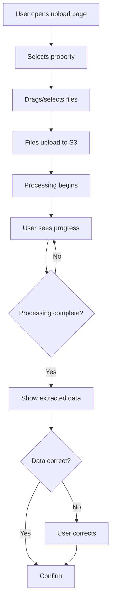
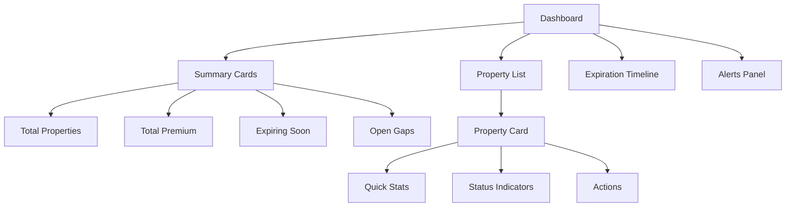
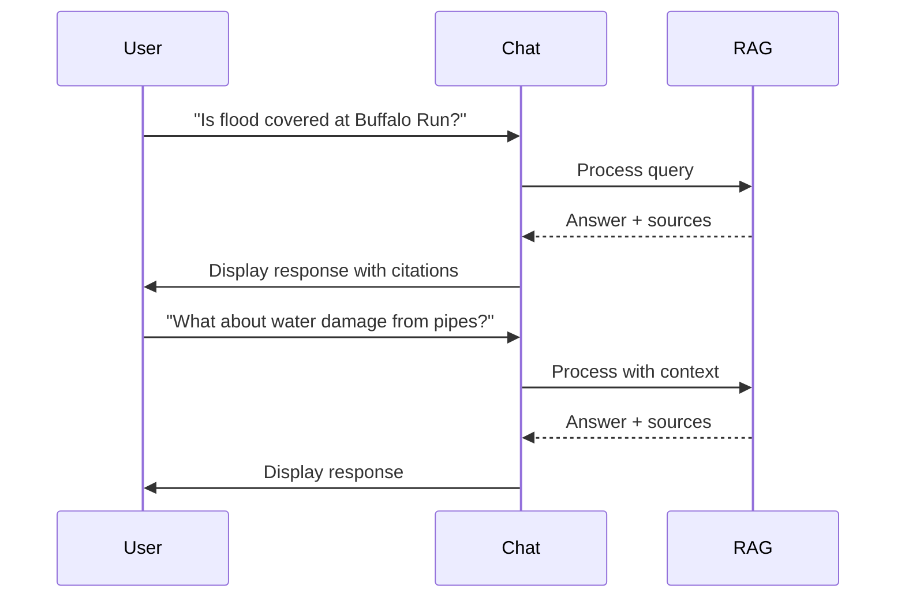
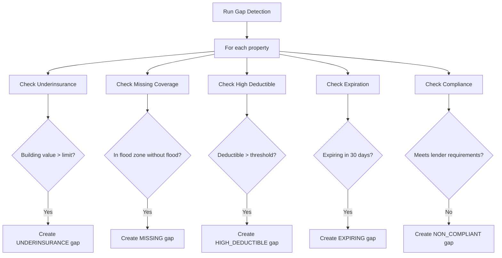
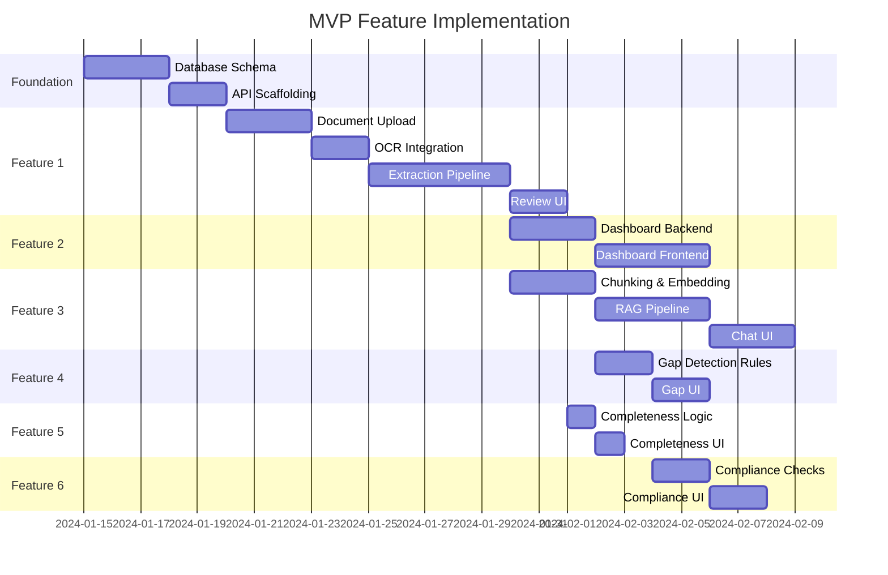

# MVP Features

## Overview

This document provides detailed specifications for the six MVP features. Each feature includes user stories, acceptance criteria, technical requirements, and UI considerations.

---

## Feature Priority Matrix

| Feature | Priority | Complexity | Dependency |
|---------|----------|------------|------------|
| Document Upload & Extraction | P0 | High | None |
| Property & Policy Dashboard | P0 | Medium | Extraction |
| RAG-Powered Q&A | P0 | High | Extraction |
| Coverage Gap Detection | P1 | Medium | Extraction |
| Document Completeness Tracker | P1 | Low | Documents |
| Lender Compliance Checking | P1 | Medium | Extraction |

---

## Feature 1: Document Upload & Extraction

### Overview

Users can upload insurance documents, and the system automatically extracts structured data.

### User Stories

```
As a property owner,
I want to upload my insurance documents,
So that I don't have to manually enter policy information.

As a property owner,
I want to see extraction progress,
So that I know when my documents are ready.

As a property owner,
I want to correct extraction errors,
So that my data is accurate.
```

### User Flow



### Acceptance Criteria

**Upload:**
- [ ] Supports PDF, XLSX, PNG, JPG files
- [ ] Max file size: 50MB
- [ ] Multiple file upload supported
- [ ] Progress indicator during upload
- [ ] Drag-and-drop support
- [ ] File type validation before upload

**Processing:**
- [ ] Document type automatically classified
- [ ] Extraction completes within 2 minutes for typical documents
- [ ] User can see processing status
- [ ] Failed processing shows clear error message

**Extraction Results:**
- [ ] Extracted fields displayed for review
- [ ] Low confidence fields highlighted
- [ ] User can edit extracted values
- [ ] Changes persist on save
- [ ] Original document viewable alongside extraction

### Technical Requirements

**Backend:**
- Presigned URL generation for S3 upload
- Document processing pipeline (OCR → Classification → Extraction)
- Extraction schemas for each document type
- Confidence scoring for each field
- Human review queue for low-confidence extractions

**Frontend:**
- File upload component with drag-and-drop
- Progress polling or WebSocket updates
- Side-by-side document viewer and extraction form
- Inline editing for extracted fields

### UI Wireframe

```
┌─────────────────────────────────────────────────────────────┐
│  Upload Documents                                            │
├─────────────────────────────────────────────────────────────┤
│                                                             │
│  Property: [ Buffalo Run ▼ ]                                │
│                                                             │
│  ┌─────────────────────────────────────────────────────┐   │
│  │                                                     │   │
│  │     📄 Drag and drop files here                     │   │
│  │        or click to browse                           │   │
│  │                                                     │   │
│  │     Supports: PDF, XLSX, PNG, JPG (max 50MB)       │   │
│  │                                                     │   │
│  └─────────────────────────────────────────────────────┘   │
│                                                             │
│  Recent Uploads:                                            │
│  ┌─────────────────────────────────────────────────────┐   │
│  │ 📄 policy_2024.pdf    ✓ Processed    [View]        │   │
│  │ 📄 coi_2024.pdf       ⏳ Processing   45%          │   │
│  │ 📄 invoice.pdf        ❌ Failed       [Retry]       │   │
│  └─────────────────────────────────────────────────────┘   │
│                                                             │
└─────────────────────────────────────────────────────────────┘
```

---

## Feature 2: Property & Policy Dashboard

### Overview

Central view of all properties and their insurance status.

### User Stories

```
As a property owner,
I want to see all my properties in one place,
So that I can quickly assess my portfolio.

As a property owner,
I want to drill down into any property,
So that I can see detailed coverage information.

As a property owner,
I want to see what's expiring soon,
So that I can plan for renewals.
```

### Dashboard Components



### Acceptance Criteria

**Dashboard:**
- [ ] Shows total property count
- [ ] Shows total annual premium
- [ ] Shows policies expiring in 30/60/90 days
- [ ] Shows count of open coverage gaps
- [ ] Real-time data (refreshes on load)

**Property List:**
- [ ] All properties displayed
- [ ] Sortable by name, premium, expiration
- [ ] Filterable by status, state
- [ ] Searchable
- [ ] Shows key stats per property

**Property Detail:**
- [ ] All policies listed
- [ ] All coverages visible
- [ ] All documents accessible
- [ ] Coverage gaps highlighted
- [ ] Edit property details

**Expiration Timeline:**
- [ ] Visual timeline of upcoming expirations
- [ ] Click to see details
- [ ] Color coded by urgency

### Technical Requirements

**Backend:**
- Aggregation queries for summary stats
- Efficient pagination for property list
- Caching for frequently accessed data

**Frontend:**
- Responsive grid layout
- Data tables with sorting/filtering
- Chart library for timeline
- Skeleton loading states

### UI Wireframe

```
┌─────────────────────────────────────────────────────────────┐
│  Dashboard                                    [+ Add Property]│
├─────────────────────────────────────────────────────────────┤
│                                                             │
│  ┌──────────┐  ┌──────────┐  ┌──────────┐  ┌──────────┐    │
│  │    7     │  │  $650K   │  │    2     │  │    5     │    │
│  │Properties│  │ Premium  │  │Exp. 30d  │  │Open Gaps │    │
│  └──────────┘  └──────────┘  └──────────┘  └──────────┘    │
│                                                             │
│  ┌─────────────────────────────────────────────────────┐   │
│  │ Expiration Timeline                                  │   │
│  │ ──●────────●─────────●──────────────────────►        │   │
│  │  Jan 15   Feb 1    Mar 15                   Jun     │   │
│  │  Shoaff   Buffalo  Market                            │   │
│  └─────────────────────────────────────────────────────┘   │
│                                                             │
│  Properties                    [Search...] [Filter ▼]       │
│  ┌─────────────────────────────────────────────────────┐   │
│  │ Buffalo Run          TX    $145K   Jan 2025   ✓     │   │
│  │ 200 units | Property, GL, Umbrella                   │   │
│  ├─────────────────────────────────────────────────────┤   │
│  │ Shoaff Park          IN    $92K    Jan 2025   ⚠     │   │
│  │ 150 units | Property, GL  | 2 gaps                   │   │
│  ├─────────────────────────────────────────────────────┤   │
│  │ Lake Sheri           GA    $78K    Mar 2025   ✓     │   │
│  │ 120 units | Property, GL, Umbrella                   │   │
│  └─────────────────────────────────────────────────────┘   │
│                                                             │
└─────────────────────────────────────────────────────────────┘
```

---

## Feature 3: RAG-Powered Q&A

### Overview

Natural language interface to ask questions about coverage.

### User Stories

```
As a property owner,
I want to ask questions in plain English,
So that I don't have to read through policy documents.

As a property owner,
I want answers with citations,
So that I can verify the information.

As a property owner,
I want to ask follow-up questions,
So that I can explore topics in depth.
```

### Conversation Flow



### Acceptance Criteria

**Query Input:**
- [ ] Text input field
- [ ] Property selector (optional)
- [ ] Submit on enter or button click
- [ ] Loading indicator during processing

**Answer Display:**
- [ ] Clear, readable answer text
- [ ] Confidence indicator
- [ ] Source citations with page numbers
- [ ] Click to view source document
- [ ] Suggested follow-up questions

**Conversation:**
- [ ] Maintains context within session
- [ ] Conversation history visible
- [ ] Can start new conversation
- [ ] Can ask without specifying property (searches all)

**Edge Cases:**
- [ ] Graceful handling when answer not found
- [ ] Warning when using expired policy data
- [ ] Handling of conflicting information

### Technical Requirements

**Backend:**
- RAG pipeline (embed → retrieve → generate)
- Pinecone vector search
- Gemini for answer generation
- Citation extraction and linking

**Frontend:**
- Chat interface component
- Streaming response display
- Source viewer integration
- Markdown rendering for answers

### UI Wireframe

```
┌─────────────────────────────────────────────────────────────┐
│  Insurance Assistant                    Property: [All ▼]    │
├─────────────────────────────────────────────────────────────┤
│                                                             │
│  ┌─────────────────────────────────────────────────────┐   │
│  │                                                     │   │
│  │  You: Is flood covered at Buffalo Run?              │   │
│  │                                                     │   │
│  │  ─────────────────────────────────────────────────  │   │
│  │                                                     │   │
│  │  🤖 Based on your property policy, flood is NOT     │   │
│  │  covered as a standard peril.                       │   │
│  │                                                     │   │
│  │  However, there is a limited water damage sublimit  │   │
│  │  of $50,000 for sudden and accidental water         │   │
│  │  discharge from plumbing systems.                   │   │
│  │                                                     │   │
│  │  Sources:                                           │   │
│  │  📄 Property Policy, Page 23 [View]                 │   │
│  │  📄 Property Policy, Page 15 [View]                 │   │
│  │                                                     │   │
│  │  Confidence: High (92%)                             │   │
│  │                                                     │   │
│  │  Follow-up questions:                               │   │
│  │  • What water damage is covered?                    │   │
│  │  • How do I add flood coverage?                     │   │
│  │                                                     │   │
│  └─────────────────────────────────────────────────────┘   │
│                                                             │
│  ┌─────────────────────────────────────────────────────┐   │
│  │ Ask a question about your coverage...        [Send] │   │
│  └─────────────────────────────────────────────────────┘   │
│                                                             │
└─────────────────────────────────────────────────────────────┘
```

---

## Feature 4: Coverage Gap Detection

### Overview

Automatic identification of potential coverage problems.

### User Stories

```
As a property owner,
I want to be alerted to coverage gaps,
So that I can address them before they become problems.

As a property owner,
I want to understand why something is flagged,
So that I can make informed decisions.

As a property owner,
I want to track resolved gaps,
So that I can see improvement over time.
```

### Gap Types

| Gap Type | Description | Severity |
|----------|-------------|----------|
| `underinsurance` | Building value > coverage limit | Critical |
| `missing_coverage` | Expected coverage not present | Critical/Warning |
| `high_deductible` | Deductible above threshold | Warning |
| `expiring` | Policy expires within 30 days | Critical |
| `non_compliant` | Fails lender requirement | Critical |
| `outdated_valuation` | Valuation >2 years old | Info |
| `missing_document` | Expected document not uploaded | Info |

### Detection Rules



### Acceptance Criteria

**Gap Detection:**
- [ ] Runs automatically when data changes
- [ ] Can be triggered manually
- [ ] Detects all defined gap types
- [ ] Assigns appropriate severity

**Gap Display:**
- [ ] Gaps visible on dashboard
- [ ] Gaps visible on property detail
- [ ] Color-coded by severity
- [ ] Clear title and description
- [ ] Shows current vs recommended value

**Gap Management:**
- [ ] Can acknowledge gap (removes from active list)
- [ ] Can resolve gap with notes
- [ ] Resolved gaps visible in history
- [ ] Gap auto-resolves when fixed

### Technical Requirements

**Backend:**
- Gap detection rules engine
- Scheduled detection jobs
- Event-triggered detection (on extraction complete)
- Gap CRUD operations

**Frontend:**
- Gap list component
- Severity indicators
- Acknowledge/resolve actions
- Gap history view

### UI Wireframe

```
┌─────────────────────────────────────────────────────────────┐
│  Coverage Gaps                              [Run Detection]  │
├─────────────────────────────────────────────────────────────┤
│                                                             │
│  Filter: [All Severities ▼] [Open ▼]  Sort: [Severity ▼]   │
│                                                             │
│  ┌─────────────────────────────────────────────────────┐   │
│  │ 🔴 CRITICAL                                          │   │
│  │                                                     │   │
│  │ Shoaff Park - High Wind Deductible                  │   │
│  │ Your wind deductible is 5% of building value        │   │
│  │ ($180,000). This exceeds the recommended 2%.        │   │
│  │                                                     │   │
│  │ Current: 5% ($180,000)                              │   │
│  │ Recommended: 2% ($72,000)                           │   │
│  │                                                     │   │
│  │ [Acknowledge]  [View Property]                      │   │
│  ├─────────────────────────────────────────────────────┤   │
│  │ 🟡 WARNING                                          │   │
│  │                                                     │   │
│  │ Lake Sheri - Missing Umbrella Coverage              │   │
│  │ Similar properties typically have umbrella coverage │   │
│  │ of at least $5,000,000.                             │   │
│  │                                                     │   │
│  │ [Acknowledge]  [View Property]                      │   │
│  └─────────────────────────────────────────────────────┘   │
│                                                             │
│  Showing 2 open gaps across 7 properties                   │
│                                                             │
└─────────────────────────────────────────────────────────────┘
```

---

## Feature 5: Document Completeness Tracker

### Overview

Shows what documents are present vs expected for each property.

### User Stories

```
As a property owner,
I want to see what documents are missing,
So that I can upload them.

As a property owner,
I want to see my progress toward complete documentation,
So that I feel motivated to complete the process.
```

### Expected Documents by Property

| Document Type | Required | Optional |
|---------------|----------|----------|
| Property Policy | ✓ | |
| GL Policy | ✓ | |
| Umbrella Policy | | ✓ |
| COI | ✓ | |
| EOP (if loan) | ✓ | |
| Current SOV | | ✓ |
| Loss Runs | | ✓ |
| Invoice | | ✓ |

### Acceptance Criteria

**Completeness Display:**
- [ ] Shows percentage complete per property
- [ ] Shows list of present documents
- [ ] Shows list of missing documents
- [ ] Progress bar visualization
- [ ] Explains why each document matters

**Actions:**
- [ ] Click to upload missing document
- [ ] Mark document as N/A (not applicable)
- [ ] Refresh completeness calculation

### UI Wireframe

```
┌─────────────────────────────────────────────────────────────┐
│  Document Completeness                                       │
├─────────────────────────────────────────────────────────────┤
│                                                             │
│  ┌─────────────────────────────────────────────────────┐   │
│  │ Buffalo Run                              85% ████████░│  │
│  │                                                     │   │
│  │ ✓ Property Policy      ✓ GL Policy                  │   │
│  │ ✓ Umbrella Policy      ✓ COI                        │   │
│  │ ✓ SOV                  ✓ Loss Runs                  │   │
│  │ ✗ Current Invoice      [Upload]                      │   │
│  └─────────────────────────────────────────────────────┘   │
│                                                             │
│  ┌─────────────────────────────────────────────────────┐   │
│  │ Shoaff Park                              60% ██████░░░│  │
│  │                                                     │   │
│  │ ✓ Property Certificate  ✓ Liability Certificate     │   │
│  │ ✓ Insurance Summary     ✓ Invoice                   │   │
│  │ ✗ Full Policy Docs      [Upload]                     │   │
│  │ ✗ SOV                   [Upload]                     │   │
│  │ ✗ Loss Runs             [Upload]                     │   │
│  └─────────────────────────────────────────────────────┘   │
│                                                             │
└─────────────────────────────────────────────────────────────┘
```

---

## Feature 6: Lender Compliance Checking

### Overview

Verify that coverage meets lender requirements.

### User Stories

```
As a property owner,
I want to know if my coverage meets lender requirements,
So that I don't risk a loan default.

As a property owner,
I want to see specific requirement gaps,
So that I can address them with my broker.
```

### Compliance Checks

| Requirement | Check | Common Threshold |
|-------------|-------|------------------|
| Property Coverage | Limit ≥ requirement | Loan amount or replacement cost |
| GL Coverage | Each occurrence ≥ requirement | $1,000,000 |
| Umbrella | Limit ≥ requirement | $5,000,000+ |
| Deductible | Amount ≤ max allowed | 5% of TIV or $50,000 |
| Flood | Required if in flood zone | Zone A, V, AE, VE |
| Mortgagee | Listed on policy | Exact name/address |
| Current | Policy not expired | Active at all times |

### Acceptance Criteria

**Compliance View:**
- [ ] Overall status per property (compliant/non-compliant)
- [ ] Individual check results
- [ ] Pass/fail for each requirement
- [ ] Shows current value vs required value

**Configuration:**
- [ ] Add lender requirements per property
- [ ] Pre-populated from common lenders
- [ ] Custom requirements supported

**Alerts:**
- [ ] Alert when compliance changes
- [ ] Alert before policy expiration

### UI Wireframe

```
┌─────────────────────────────────────────────────────────────┐
│  Lender Compliance - Buffalo Run                             │
├─────────────────────────────────────────────────────────────┤
│                                                             │
│  Lender: Wells Fargo  |  Loan #: 123456789                 │
│  Overall Status: ⚠️ NON-COMPLIANT (1 issue)                 │
│                                                             │
│  ┌─────────────────────────────────────────────────────┐   │
│  │ Requirement          Current      Required   Status │   │
│  ├─────────────────────────────────────────────────────┤   │
│  │ Property Coverage    $35,989,980  $30,000,000  ✓    │   │
│  │ GL Each Occurrence   $1,000,000   $1,000,000   ✓    │   │
│  │ Umbrella Coverage    $10,000,000  $5,000,000   ✓    │   │
│  │ Wind Deductible      5%           ≤2%          ❌    │   │
│  │ Flood Coverage       N/A          Required if  ✓    │   │
│  │                                   in zone A/V       │   │
│  │ Mortgagee Listed     Yes          Required     ✓    │   │
│  │ Policy Current       Yes          Required     ✓    │   │
│  └─────────────────────────────────────────────────────┘   │
│                                                             │
│  Issue Details:                                             │
│  Wind deductible of 5% exceeds lender maximum of 2%.        │
│  This may trigger a loan covenant violation.                │
│                                                             │
│  Recommended Action:                                        │
│  Contact your broker about reducing wind deductible at      │
│  renewal, or request a waiver from the lender.              │
│                                                             │
│  [Edit Requirements]  [Export Report]                       │
│                                                             │
└─────────────────────────────────────────────────────────────┘
```

---

## Implementation Order

Based on dependencies and value delivery:



---

## Success Metrics

| Feature | Metric | Target |
|---------|--------|--------|
| Document Upload | Upload success rate | >99% |
| Document Upload | Extraction accuracy | >90% on key fields |
| Dashboard | Page load time | <2 seconds |
| RAG Q&A | Answer relevance (user rating) | >85% helpful |
| RAG Q&A | Response time | <3 seconds |
| Gap Detection | False positive rate | <10% |
| Completeness | User completion rate | >70% achieve 100% |
| Compliance | Accuracy of checks | >99% |

---

## Next Steps

Proceed to [08-development-roadmap.md](./08-development-roadmap.md) for the implementation timeline.