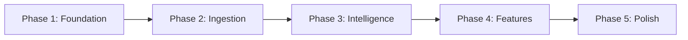

# Development Roadmap

## Overview

This document outlines the implementation plan for the Open Insurance MVP. The roadmap is organized into phases with clear milestones and deliverables.

**Note:** This roadmap provides implementation phases without specific calendar dates. The actual timeline depends on team size and availability.

---

## Development Phases



| Phase | Focus | Key Deliverables |
|-------|-------|------------------|
| 1 | Foundation | Project setup, DB schema, API scaffold |
| 2 | Ingestion | Upload, OCR, extraction pipeline |
| 3 | Intelligence | RAG system, embeddings, Q&A |
| 4 | Features | Dashboard, gaps, compliance |
| 5 | Polish | UI refinement, testing, deployment |

---

## Phase 1: Foundation

### Objectives
- Set up development environment
- Implement database schema
- Create API scaffolding
- Establish CI/CD pipeline

### Deliverables

```
┌─────────────────────────────────────────────────────────────┐
│  PHASE 1 DELIVERABLES                                        │
├─────────────────────────────────────────────────────────────┤
│                                                             │
│  Backend:                                                   │
│  ✓ FastAPI project structure                                │
│  ✓ SQLAlchemy models (all tables)                          │
│  ✓ Alembic migrations                                       │
│  ✓ Database connection pooling                              │
│  ✓ Basic health check endpoint                              │
│  ✓ Environment configuration                                │
│                                                             │
│  Infrastructure:                                            │
│  ✓ PostgreSQL database (local + cloud)                      │
│  ✓ S3 bucket configured                                     │
│  ✓ Pinecone index created                                   │
│  ✓ API keys for external services                           │
│                                                             │
│  DevOps:                                                    │
│  ✓ Docker Compose for local dev                             │
│  ✓ GitHub Actions for CI                                    │
│  ✓ Linting and formatting (Ruff)                            │
│                                                             │
└─────────────────────────────────────────────────────────────┘
```

### Tasks

| Task | Description | Effort |
|------|-------------|--------|
| Project setup | FastAPI project, dependencies, structure | S |
| Database models | All SQLAlchemy models from schema doc | M |
| Migrations | Alembic setup and initial migration | S |
| Config management | Pydantic settings, env vars | S |
| Docker setup | Docker Compose for local development | S |
| CI pipeline | GitHub Actions for tests + lint | S |
| S3 setup | Bucket creation, IAM policies | S |
| Pinecone setup | Index creation, test connection | S |
| Health endpoints | Basic API health checks | S |

### Milestone Criteria
- [ ] `docker-compose up` starts all services
- [ ] Database migrations run successfully
- [ ] Health check returns 200
- [ ] CI pipeline passes

---

## Phase 2: Ingestion Pipeline

### Objectives
- Implement document upload flow
- Integrate Mistral OCR
- Build extraction pipeline
- Store structured data

### Deliverables

```
┌─────────────────────────────────────────────────────────────┐
│  PHASE 2 DELIVERABLES                                        │
├─────────────────────────────────────────────────────────────┤
│                                                             │
│  Upload:                                                    │
│  ✓ Presigned URL generation                                 │
│  ✓ Upload completion handling                               │
│  ✓ File type validation                                     │
│  ✓ Document record creation                                 │
│                                                             │
│  OCR:                                                       │
│  ✓ Mistral OCR integration                                  │
│  ✓ PDF processing                                           │
│  ✓ Table extraction                                         │
│  ✓ OCR output storage                                       │
│                                                             │
│  Extraction:                                                │
│  ✓ Document classification                                  │
│  ✓ Policy extraction schema                                 │
│  ✓ COI extraction schema                                    │
│  ✓ Invoice extraction schema                                │
│  ✓ Gemini integration                                       │
│  ✓ Validation layer                                         │
│  ✓ Confidence scoring                                       │
│                                                             │
│  Storage:                                                   │
│  ✓ Policy records created                                   │
│  ✓ Coverage records created                                 │
│  ✓ Certificate records created                              │
│  ✓ Provenance tracking                                      │
│                                                             │
└─────────────────────────────────────────────────────────────┘
```

### Tasks

| Task | Description | Effort |
|------|-------------|--------|
| Upload endpoints | Presigned URL, complete upload | M |
| S3 integration | Upload, download, presigned URLs | S |
| Mistral OCR client | API wrapper, error handling | M |
| OCR processing | PDF → markdown pipeline | M |
| Document classifier | Gemini-based classification | M |
| Policy schema | Pydantic model + prompt | M |
| COI schema | Pydantic model + prompt | M |
| Invoice schema | Pydantic model + prompt | S |
| Extraction orchestrator | Pipeline coordination | M |
| Validation rules | Sanity checks, confidence | M |
| Record creation | Policy, coverage CRUD | M |
| Processing queue | Simple job queue | M |

### Milestone Criteria
- [ ] Can upload a PDF via API
- [ ] OCR extracts text from PDF
- [ ] Classification identifies document type
- [ ] Extraction creates policy + coverage records
- [ ] Extraction confidence > 85% on test docs

---

## Phase 3: Intelligence Layer

### Objectives
- Implement document chunking
- Generate and store embeddings
- Build RAG retrieval pipeline
- Create Q&A interface

### Deliverables

```
┌─────────────────────────────────────────────────────────────┐
│  PHASE 3 DELIVERABLES                                        │
├─────────────────────────────────────────────────────────────┤
│                                                             │
│  Chunking:                                                  │
│  ✓ Section-based splitting                                  │
│  ✓ Table preservation                                       │
│  ✓ Chunk classification                                     │
│  ✓ Metadata attachment                                      │
│                                                             │
│  Embeddings:                                                │
│  ✓ OpenAI embeddings integration                            │
│  ✓ Batch embedding generation                               │
│  ✓ Pinecone upsert                                          │
│  ✓ Metadata indexing                                        │
│                                                             │
│  RAG:                                                       │
│  ✓ Query embedding                                          │
│  ✓ Filtered vector search                                   │
│  ✓ Context assembly                                         │
│  ✓ Answer generation                                        │
│  ✓ Citation extraction                                      │
│                                                             │
│  API:                                                       │
│  ✓ Chat endpoint                                            │
│  ✓ Streaming response                                       │
│  ✓ Conversation context                                     │
│                                                             │
└─────────────────────────────────────────────────────────────┘
```

### Tasks

| Task | Description | Effort |
|------|-------------|--------|
| Chunking logic | Split documents into chunks | M |
| Chunk classifier | Identify chunk types | S |
| OpenAI client | Embeddings API wrapper | S |
| Batch embedder | Process chunks in batches | M |
| Pinecone client | Upsert, query, delete | M |
| Query processor | Parse user queries | M |
| Retrieval logic | Filtered vector search | M |
| Context builder | Assemble RAG prompt | M |
| Answer generator | Gemini response generation | M |
| Citation extractor | Extract source references | S |
| Chat endpoint | REST API for Q&A | M |
| Streaming endpoint | SSE for real-time response | M |

### Milestone Criteria
- [ ] Documents chunked and embedded
- [ ] Vector search returns relevant chunks
- [ ] RAG answers questions with citations
- [ ] Response time < 3 seconds

---

## Phase 4: Core Features

### Objectives
- Build property dashboard
- Implement gap detection
- Add compliance checking
- Create completeness tracking

### Deliverables

```
┌─────────────────────────────────────────────────────────────┐
│  PHASE 4 DELIVERABLES                                        │
├─────────────────────────────────────────────────────────────┤
│                                                             │
│  Dashboard API:                                             │
│  ✓ Property list endpoint                                   │
│  ✓ Property detail endpoint                                 │
│  ✓ Policy list/detail endpoints                             │
│  ✓ Summary statistics                                       │
│  ✓ Expiration timeline                                      │
│                                                             │
│  Gap Detection:                                             │
│  ✓ Detection rules engine                                   │
│  ✓ Underinsurance check                                     │
│  ✓ Missing coverage check                                   │
│  ✓ High deductible check                                    │
│  ✓ Expiration check                                         │
│  ✓ Gap CRUD endpoints                                       │
│                                                             │
│  Compliance:                                                │
│  ✓ Lender requirements model                                │
│  ✓ Compliance check logic                                   │
│  ✓ Compliance status endpoint                               │
│                                                             │
│  Completeness:                                              │
│  ✓ Expected documents per property                          │
│  ✓ Completeness calculation                                 │
│  ✓ Completeness endpoint                                    │
│                                                             │
└─────────────────────────────────────────────────────────────┘
```

### Tasks

| Task | Description | Effort |
|------|-------------|--------|
| Property CRUD | Create, read, update, delete | M |
| Property list | Pagination, filtering, search | M |
| Policy endpoints | List, detail, by property | M |
| Coverage endpoints | List by policy | S |
| Summary stats | Aggregation queries | M |
| Gap rules engine | Rule definition + execution | M |
| Underinsurance rule | Compare limit vs value | S |
| Missing coverage rule | Check expected vs actual | M |
| Deductible rule | Threshold comparison | S |
| Expiration rule | Date-based check | S |
| Gap endpoints | List, acknowledge, resolve | M |
| Lender requirements | CRUD for requirements | M |
| Compliance checker | Evaluate requirements | M |
| Completeness calc | Document presence check | S |

### Milestone Criteria
- [ ] Property list shows all properties
- [ ] Gap detection identifies real gaps
- [ ] Compliance checks match lender rules
- [ ] Completeness % calculated correctly

---

## Phase 5: Frontend & Polish

### Objectives
- Build user interface
- Integration testing
- Performance optimization
- Deployment preparation

### Deliverables

```
┌─────────────────────────────────────────────────────────────┐
│  PHASE 5 DELIVERABLES                                        │
├─────────────────────────────────────────────────────────────┤
│                                                             │
│  Frontend:                                                  │
│  ✓ Next.js project setup                                    │
│  ✓ Authentication flow                                      │
│  ✓ Dashboard page                                           │
│  ✓ Property detail page                                     │
│  ✓ Document upload component                                │
│  ✓ Chat interface                                           │
│  ✓ Gaps page                                                │
│  ✓ Compliance page                                          │
│                                                             │
│  Testing:                                                   │
│  ✓ Unit tests for extraction                                │
│  ✓ Integration tests for API                                │
│  ✓ E2E tests for critical flows                             │
│                                                             │
│  Deployment:                                                │
│  ✓ Production environment setup                             │
│  ✓ Database provisioning                                    │
│  ✓ Environment variables                                    │
│  ✓ Monitoring and logging                                   │
│                                                             │
└─────────────────────────────────────────────────────────────┘
```

### Tasks

| Task | Description | Effort |
|------|-------------|--------|
| Next.js setup | Project structure, routing | M |
| Auth integration | Login, logout, session | M |
| Dashboard UI | Summary cards, property list | L |
| Property detail UI | Policies, coverages, docs | L |
| Upload component | Drag-drop, progress | M |
| Chat UI | Message list, input, sources | L |
| Gaps UI | List, severity, actions | M |
| Compliance UI | Status, requirements | M |
| Unit tests | Extraction, validation | M |
| Integration tests | API endpoints | M |
| E2E tests | Upload → extraction flow | M |
| Deployment setup | Railway/Vercel config | M |
| Monitoring | Logging, error tracking | M |

### Milestone Criteria
- [ ] All pages functional
- [ ] Test coverage > 70%
- [ ] Production deployment works
- [ ] <2s page load times

---

## Effort Estimates

| Size | Description | Story Points |
|------|-------------|--------------|
| S | Simple, well-understood | 1-2 |
| M | Medium complexity | 3-5 |
| L | Large, multiple components | 8-13 |

### Phase Totals

| Phase | S Tasks | M Tasks | L Tasks | Estimated Points |
|-------|---------|---------|---------|------------------|
| 1 Foundation | 8 | 1 | 0 | 12 |
| 2 Ingestion | 2 | 10 | 0 | 38 |
| 3 Intelligence | 3 | 9 | 0 | 33 |
| 4 Features | 5 | 9 | 0 | 37 |
| 5 Polish | 0 | 9 | 4 | 77 |
| **Total** | | | | **~197 points** |

---

## Technical Milestones

### Milestone 1: "Hello World"
- API returns health check
- Database connection works
- Can create a property via API

### Milestone 2: "First Extraction"
- Upload a PDF
- OCR extracts text
- Classification identifies type
- Basic extraction creates records

### Milestone 3: "Ask a Question"
- Documents are chunked and embedded
- RAG answers a coverage question
- Answer includes citations

### Milestone 4: "See My Portfolio"
- Dashboard shows all properties
- Can drill into property details
- Gaps are detected and displayed

### Milestone 5: "Production Ready"
- All features functional
- Tests passing
- Deployed to production

---

## Risk Mitigation

### Technical Risks

| Risk | Impact | Mitigation |
|------|--------|------------|
| OCR accuracy on scanned docs | High | Test with real docs early, have fallback |
| LLM extraction inconsistency | High | Strict schemas, validation, retry logic |
| Pinecone latency | Medium | Optimize chunk size, use filtering |
| Complex PDF formats | Medium | Handle gracefully, flag for review |

### Schedule Risks

| Risk | Impact | Mitigation |
|------|--------|------------|
| Scope creep | High | Strict MVP definition, defer nice-to-haves |
| Integration issues | Medium | Early integration testing |
| External API changes | Low | Abstract behind interfaces |

---

## Definition of Done

### Feature Complete
- [ ] Acceptance criteria met
- [ ] API endpoints documented
- [ ] Unit tests written
- [ ] Integration tests passing
- [ ] Code reviewed
- [ ] No critical bugs

### Phase Complete
- [ ] All features in phase complete
- [ ] Milestone criteria met
- [ ] Documentation updated
- [ ] Demo prepared

### MVP Complete
- [ ] All 6 features working
- [ ] End-to-end flow tested
- [ ] Performance acceptable
- [ ] Production deployed
- [ ] Real documents processed

---

## Post-MVP Roadmap

### v1.1 Features
- Insurance Score per property
- Policy comparison (year-over-year)
- Improved extraction accuracy
- Mobile-responsive UI

### v1.2 Features
- Renewal intelligence
- Premium benchmarking
- Email document ingestion
- Bulk operations

### v2.0 Features
- Multi-tenant organizations
- Portfolio risk heatmap
- Program simulator
- API for integrations

---

## Next Steps

Proceed to [09-decision-log.md](./09-decision-log.md) to see the rationale behind key technical decisions.